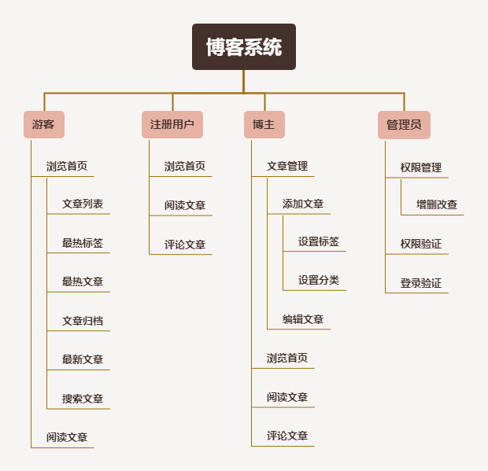

# Blog-Springboot

前后端分离实现博客系统


前端：Vue（此项目中不关注前端）

后端：SpringBoot + SpringMVC + Mybatis-plus + MySQL + Redis


## 需求分析




## ER图

为了清晰实体之间关系，此ER图未包含属性


## 数据库设计

### 系统用户类

#### 系统用户表：ms_sys_user

`id` ：用户id【主键】 `bigint(0)`
`account`：账号 `varchar`
`admin`：是否管理员 `bit(1)`
`avatar` ：头像 `varchar`
`create_date`：注册时间 `bigint(0)`
`deleted`：是否删除
`email`：邮箱
`last_login` ：最后登录时间 `bigint`
`mobile_phone_number` ：手机号 `varchar`
`nickname` ：昵称
`password` ：密码 `varchar(64)`
`salt` ：加密盐 
`status`：状态

```sql
CREATE TABLE `ms_sys_user`  (
  `id` bigint(0) NOT NULL AUTO_INCREMENT,
  `account` varchar(64) CHARACTER SET utf8 COLLATE utf8_general_ci NULL DEFAULT NULL COMMENT '账号',
  `admin` bit(1) NULL DEFAULT NULL COMMENT '是否管理员',
  `avatar` varchar(255) CHARACTER SET utf8 COLLATE utf8_general_ci NULL DEFAULT NULL COMMENT '头像',
  `create_date` bigint(0) NULL DEFAULT NULL COMMENT '注册时间',
  `deleted` bit(1) NULL DEFAULT NULL COMMENT '是否删除',
  `email` varchar(128) CHARACTER SET utf8 COLLATE utf8_general_ci NULL DEFAULT NULL COMMENT '邮箱',
  `last_login` bigint(0) NULL DEFAULT NULL COMMENT '最后登录时间',
  `mobile_phone_number` varchar(20) CHARACTER SET utf8 COLLATE utf8_general_ci NULL DEFAULT NULL COMMENT '手机号',
  `nickname` varchar(255) CHARACTER SET utf8 COLLATE utf8_general_ci NULL DEFAULT NULL COMMENT '昵称',
  `password` varchar(64) CHARACTER SET utf8 COLLATE utf8_general_ci NULL DEFAULT NULL COMMENT '密码',
  `salt` varchar(255) CHARACTER SET utf8 COLLATE utf8_general_ci NULL DEFAULT NULL COMMENT '加密盐',
  `status` varchar(255) CHARACTER SET utf8 COLLATE utf8_general_ci NULL DEFAULT NULL COMMENT '状态',
  PRIMARY KEY (`id`) USING BTREE
) ENGINE = InnoDB AUTO_INCREMENT = 1404448588146192387 CHARACTER SET = utf8 COLLATE = utf8_general_ci ROW_FORMAT = Dynamic;
```


#### 管理员表: ms_admin

`id`：管理员id【主键】(系统用户表的id)

`username`：管理员姓名

`password`：管理员密码

```sql
CREATE TABLE `ms_admin`  (
  `id` bigint(0) NOT NULL AUTO_INCREMENT,
  `username` varchar(255) CHARACTER SET utf8mb4 COLLATE utf8mb4_unicode_ci NOT NULL,
  `password` varchar(255) CHARACTER SET utf8mb4 COLLATE utf8mb4_unicode_ci NOT NULL,
  PRIMARY KEY (`id`) USING BTREE
) ENGINE = InnoDB CHARACTER SET = utf8mb4 COLLATE = utf8mb4_unicode_ci ROW_FORMAT = Dynamic;
```


#### 权限表：ms_permission

`id`：权限id【主键】 

`name`：权限名

`path`：权限所能访问到的网页

`description`：描述

```sql
CREATE TABLE `ms_permission`  (
  `id` bigint(0) NOT NULL AUTO_INCREMENT,
  `name` varchar(255) CHARACTER SET utf8mb4 COLLATE utf8mb4_unicode_ci NOT NULL,
  `path` varchar(255) CHARACTER SET utf8mb4 COLLATE utf8mb4_unicode_ci NOT NULL,
  `description` varchar(255) CHARACTER SET utf8mb4 COLLATE utf8mb4_unicode_ci NOT NULL,
  PRIMARY KEY (`id`) USING BTREE
) ENGINE = InnoDB CHARACTER SET = utf8mb4 COLLATE = utf8mb4_unicode_ci ROW_FORMAT = Dynamic;
```


#### 管理员权限表：ms_admin_permission

`id`：管理员权限id【主键】

`admin_id`：管理员id

`permission_id`：权限id

```sql
CREATE TABLE `ms_admin_permission`  (
  `id` bigint(0) NOT NULL AUTO_INCREMENT,
  `admin_id` bigint(0) NOT NULL,
  `permission_id` bigint(0) NOT NULL,
  PRIMARY KEY (`id`) USING BTREE
) ENGINE = InnoDB CHARACTER SET = utf8mb4 COLLATE = utf8mb4_unicode_ci ROW_FORMAT = Dynamic;
```


### 文章类

#### 文章分类表：ms_category

`id `：分类id【主键】
`avatar`：头像
`category_name`：分类名

`description`：描述

```sql
CREATE TABLE `ms_category`  (
  `id` bigint(0) NOT NULL AUTO_INCREMENT,
  `avatar` varchar(255) CHARACTER SET utf8mb4 COLLATE utf8mb4_unicode_ci NULL DEFAULT NULL,
  `category_name` varchar(255) CHARACTER SET utf8mb4 COLLATE utf8mb4_unicode_ci NULL DEFAULT NULL,
  `description` varchar(255) CHARACTER SET utf8mb4 COLLATE utf8mb4_unicode_ci NULL DEFAULT NULL,
  PRIMARY KEY (`id`) USING BTREE
) ENGINE = InnoDB AUTO_INCREMENT = 6 CHARACTER SET = utf8 COLLATE = utf8_general_ci ROW_FORMAT = Dynamic;
```


#### 文章表：ms_article

`id` ：文章id【主键】
`comment_counts` ：评论数量` int(0)`
`create_date` ：创建时间
`summary` ：简介
`title` ：标题
`view_counts` ：浏览数量
`weight`：是否置顶 `int(0)`
`author_id`：作者id
`body_id` ：内容id
`category_id`：类别id

```sql
CREATE TABLE `ms_article`  (
  `id` bigint(0) NOT NULL AUTO_INCREMENT,
  `comment_counts` int(0) NULL DEFAULT NULL COMMENT '评论数量',
  `create_date` bigint(0) NULL DEFAULT NULL COMMENT '创建时间',
  `summary` varchar(255) CHARACTER SET utf8 COLLATE utf8_general_ci NULL DEFAULT NULL COMMENT '简介',
  `title` varchar(64) CHARACTER SET utf8 COLLATE utf8_general_ci NULL DEFAULT NULL COMMENT '标题',
  `view_counts` int(0) NULL DEFAULT NULL COMMENT '浏览数量',
  `weight` int(0) NOT NULL COMMENT '是否置顶',
  `author_id` bigint(0) NULL DEFAULT NULL COMMENT '作者id',
  `body_id` bigint(0) NULL DEFAULT NULL COMMENT '内容id',
  `category_id` int(0) NULL DEFAULT NULL COMMENT '类别id',
  PRIMARY KEY (`id`) USING BTREE
) ENGINE = InnoDB AUTO_INCREMENT = 1405916999732707331 CHARACTER SET = utf8 COLLATE = utf8_general_ci ROW_FORMAT = Dynamic;
```


#### 文章内容表：ms_article_body

`id` ：文章内容id【主键】
`content`：文章内容 `longtext`
`content_html` ：文章网页
`article_id`：文章id【索引】

```sql
CREATE TABLE `ms_article_body`  (
  `id` bigint(0) NOT NULL AUTO_INCREMENT,
  `content` longtext CHARACTER SET utf8 COLLATE utf8_general_ci NULL,
  `content_html` longtext CHARACTER SET utf8 COLLATE utf8_general_ci NULL,
  `article_id` bigint(0) NOT NULL,
  PRIMARY KEY (`id`) USING BTREE,
  INDEX `article_id`(`article_id`) USING BTREE
) ENGINE = InnoDB AUTO_INCREMENT = 1405916999854342147 CHARACTER SET = utf8 COLLATE = utf8_general_ci ROW_FORMAT = Dynamic;
```


#### 标签表：ms_tag

`id` ：标签id【主键】
`avatar`：头像
`tag_name` ：标签名

```sql
CREATE TABLE `ms_tag`  (
  `id` bigint(0) NOT NULL AUTO_INCREMENT,
  `avatar` varchar(255) CHARACTER SET utf8mb4 COLLATE utf8mb4_unicode_ci NULL DEFAULT NULL,
  `tag_name` varchar(255) CHARACTER SET utf8mb4 COLLATE utf8mb4_unicode_ci NULL DEFAULT NULL,
  PRIMARY KEY (`id`) USING BTREE
) ENGINE = InnoDB AUTO_INCREMENT = 11 CHARACTER SET = utf8 COLLATE = utf8_general_ci ROW_FORMAT = Dynamic;
```


#### 文章标签表：ms_article_tag

`id` ：文章标签id【主键】
`article_id`：文章id【索引】
`tag_id`：文章标签id【索引】

```sql
CREATE TABLE `ms_article_tag`  (
  `id` bigint(0) NOT NULL AUTO_INCREMENT,
  `article_id` bigint(0) NOT NULL,
  `tag_id` bigint(0) NOT NULL,
  PRIMARY KEY (`id`) USING BTREE,
  INDEX `article_id`(`article_id`) USING BTREE,
  INDEX `tag_id`(`tag_id`) USING BTREE
) ENGINE = InnoDB AUTO_INCREMENT = 1405916999787233282 CHARACTER SET = utf8 COLLATE = utf8_general_ci ROW_FORMAT = Dynamic;
```


#### 文章评论表：ms_comment

`id `：评论id【主键】
`content`：评论内容
`create_date`：评论时间

`article_id`：评论文章id【索引】

`author_id`：谁评论的

`parent_id`：盖楼功能对评论的评论进行回复

`to_uid`：给谁评论

`level`：评论的是第几层（1级表示最上层的评论，2表示对评论的评论）

```sql
CREATE TABLE `ms_comment`  (
  `id` bigint(0) NOT NULL AUTO_INCREMENT,
  `content` varchar(255) CHARACTER SET utf8mb4 COLLATE utf8mb4_unicode_ci NOT NULL,
  `create_date` bigint(0) NOT NULL,
  `article_id` int(0) NOT NULL,
  `author_id` bigint(0) NOT NULL,
  `parent_id` bigint(0) NOT NULL,
  `to_uid` bigint(0) NOT NULL,
  `level` varchar(1) CHARACTER SET utf8 COLLATE utf8_general_ci NOT NULL,
  PRIMARY KEY (`id`) USING BTREE,
  INDEX `article_id`(`article_id`) USING BTREE
) ENGINE = InnoDB AUTO_INCREMENT = 1405209691876790275 CHARACTER SET = utf8 COLLATE = utf8_general_ci ROW_FORMAT = Dynamic;
```


## 后端功能实现细节

请参考docs细节


## 效果
