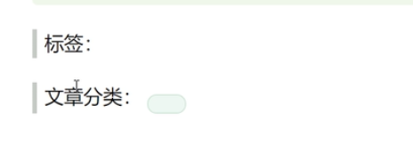
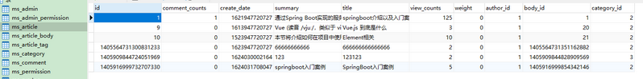
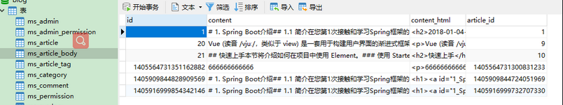
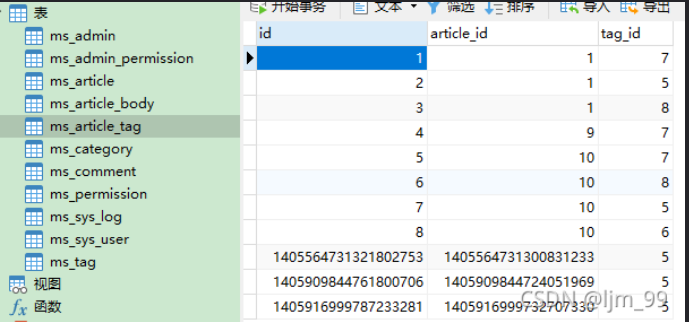
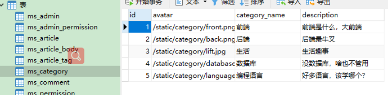
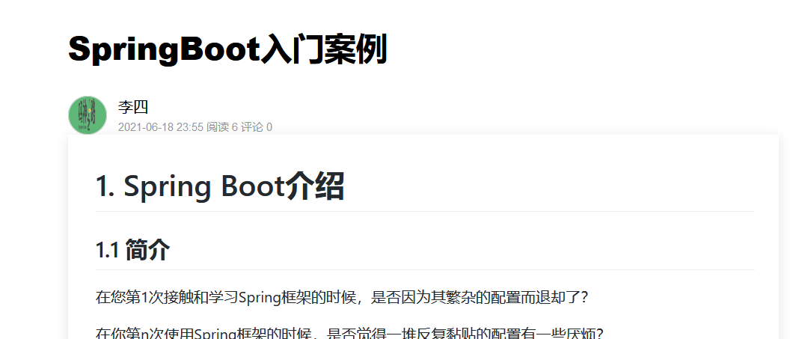
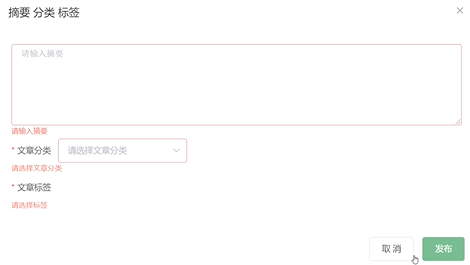
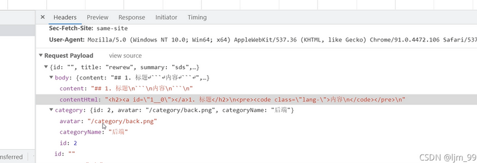
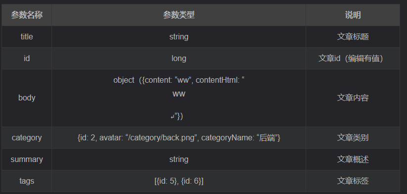

# 后端工程搭建

## 新建maven工程

### pom.xml

blog\blog-api\pom.xml

#### 标签

**packaging**

是maven的打包方式,指定工程发布时module的发布方式,有pom,jar,war; jar对应项目发布时module封装为jar包;war对应项目发布时module封装为war包;pom的module中无任何JAVA代码,不存放任何代码,仅作为聚合同项目的其他module使用;


**parent**

在多模块（module）的项目中，有很多模块中的pom中存在相同的引用，如果此时声明一个父pom文件，将公用的依赖提取到父pom文件中（即使用<parent>标签），将大大减少其他pom文件中的依赖的配置


**dependencyManagement**

在父模块中：

```xml
<dependencyManagement>
        <dependencies>
            <dependency>
                <groupId>mysql</groupId>
                <artifactId>mysql-connector-java</artifactId>
                <version>5.1.44</version>
            </dependency>
           
        </dependencies>
</dependencyManagement>
```

那么在子模块中只需要<groupId>和<artifactId>即可，如：

```xml
 <dependencies>
        <dependency>
            <groupId>mysql</groupId>
            <artifactId>mysql-connector-java</artifactId>
        </dependency>
 </dependencies>
```
与dependencies区别：

1)Dependencies相对于dependencyManagement，所有生命在dependencies里的依赖都会自动引入，并默认被所有的子项目继承。
2)dependencyManagement里只是声明依赖，并不自动实现引入，因此子项目需要显示的声明需要用的依赖。如果不在子项目中声明依赖，是不会从父项目中继承下来的；**只有在子项目中写了该依赖项，并且没有指定具体版本，才会从父项目中继承该项目**，并且version和scope都读取自父pom;另外如果子项目中指定了版本号，那么会使用子项目中指定的jar版本。


#### 完整pom.xml文件

```xml
<?xml version="1.0" encoding="UTF-8"?>
<project xmlns="http://maven.apache.org/POM/4.0.0"
         xmlns:xsi="http://www.w3.org/2001/XMLSchema-instance"
         xsi:schemaLocation="http://maven.apache.org/POM/4.0.0 http://maven.apache.org/xsd/maven-4.0.0.xsd">
    <modelVersion>4.0.0</modelVersion>

    <groupId>com.mszlu</groupId>
    <artifactId>blog-parent</artifactId>
    <version>1.0-SNAPSHOT</version>
    <modules>
        <module>blog-api</module>
        <module>blog-admin</module>
    </modules>
    <packaging>pom</packaging>
    <parent>
        <groupId>org.springframework.boot</groupId>
        <artifactId>spring-boot-starter-parent</artifactId>
        <version>2.5.0</version>
        <relativePath/>
    </parent>

    <properties>
        <project.build.sourceEncoding>UTF-8</project.build.sourceEncoding>
        <project.reporting.outputEncoding>UTF-8</project.reporting.outputEncoding>
        <java.version>1.8</java.version>
    </properties>

    <dependencyManagement>
    <dependencies>

            <dependency>
                <groupId>com.alibaba</groupId>
                <artifactId>fastjson</artifactId>
                <version>1.2.76</version>
            </dependency>

            <dependency>
                <groupId>commons-collections</groupId>
                <artifactId>commons-collections</artifactId>
                <version>3.2.2</version>
            </dependency>

            <dependency>
                <groupId>com.baomidou</groupId>
                <artifactId>mybatis-plus-boot-starter</artifactId>
                <version>3.4.3</version>
            </dependency>
            <!-- https://mvnrepository.com/artifact/joda-time/joda-time -->
            <dependency>
                <groupId>joda-time</groupId>
                <artifactId>joda-time</artifactId>
                <version>2.10.10</version>
            </dependency>
        </dependencies>
    </dependencyManagement>
    <build>
        <plugins>
            <plugin>
                <groupId>org.springframework.boot</groupId>
                <artifactId>spring-boot-maven-plugin</artifactId>
            </plugin>
        </plugins>
    </build>
</project>
```


## 配置

### application.properties

blog\blog-api\blog-api\src\main\resources\application.properties

#### 端口号

由于在前端项目中，blog\blog-ui\config\dev.env.js中指定了端口号为8888

```js
'use strict'
const merge = require('webpack-merge')
const prodEnv = require('./prod.env')

module.exports = merge(prodEnv, {
  NODE_ENV: '"development"',
  BASE_API: '"http://localhost:8888"'
})
```

所以

```properties
server.port=8888
spring.application.name=mszlu_blog
```

> dev是生产环境
>
> prod是开发环境


#### 数据库配置

datasource

mybatis-plus

```properties
# datasource \u5BC6\u7801 root root
spring.datasource.url=jdbc:mysql://localhost:3306/blog?useUnicode=true&characterEncoding=UTF-8&serverTimeZone=UTC
spring.datasource.username=root
spring.datasource.password=****
spring.datasource.driver-class-name=com.mysql.cj.jdbc.Driver

#spring.profiles.active=prod
#mybatis-plus
#使其打印到控制台,打印日志，看到一些sql语句
mybatis-plus.configuration.log-impl=org.apache.ibatis.logging.stdout.StdOutImpl
#代表数据库表名的前缀都是ms_，这样使其省略前缀，不用再重复写表名的前缀
mybatis-plus.global-config.db-config.table-prefix=ms_
```


#### 完整文件

```properties
server.port=8888
spring.application.name=mszlu_blog

#rocketmq\u914D\u7F6E
#rocketmq.name-server=192.168.200.100:9876
#rocketmq.producer.group=blog_group

# datasource \u5BC6\u7801 root root
spring.datasource.url=jdbc:mysql://localhost:3306/blog?useUnicode=true&characterEncoding=UTF-8&serverTimeZone=UTC
spring.datasource.username=root
spring.datasource.password=*****
spring.datasource.driver-class-name=com.mysql.cj.jdbc.Driver

#spring.profiles.active=prod
#mybatis-plus
#mybatis-plus.configuration.log-impl=org.apache.ibatis.logging.stdout.StdOutImpl
mybatis-plus.global-config.db-config.table-prefix=ms_

spring.redis.host=localhost
spring.redis.port=6379

spring.servlet.multipart.max-request-size=20MB
spring.servlet.multipart.max-file-size=2MB

jasypt.encryptor.password=mszlu_blog_$#@wzb_&^%$#


qiniu.accessKey=11
qiniu.accessSecretKey=22
```


### MybatisPlusConfig.java

blog\blog-api\blog-api\src\main\java\com\mszlu\blog\config\MybatisPlusConfig.java

#### 配置分页插件

注册到spring容器中

```java
package com.mszlu.blog.config;

import com.baomidou.mybatisplus.extension.plugins.MybatisPlusInterceptor;
import com.baomidou.mybatisplus.extension.plugins.inner.PaginationInnerInterceptor;
import org.mybatis.spring.annotation.MapperScan;
import org.springframework.context.annotation.Bean;
import org.springframework.context.annotation.Configuration;

//让spring可以扫描到它
@Configuration
//扫包，将此包下的接口生成代理实现类，并且注册到spring容器中
@MapperScan("com.mszlu.blog.dao.mapper")
public class MybatisPlusConfig {

    //内置分页插件
    //@Configuration可理解为用spring的时候xml里面的<beans>标签。
    // @Bean可理解为用spring的时候xml里面的<bean>标签。
    @Bean
    public MybatisPlusInterceptor mybatisPlusInterceptor(){
        MybatisPlusInterceptor interceptor = new MybatisPlusInterceptor();
        interceptor.addInnerInterceptor(new PaginationInnerInterceptor());
        return interceptor;
    }
}
```


### WebMVCConfig.java

blog\blog-api\blog-api\src\main\java\com\mszlu\blog\config\WebMVCConfig.java

#### 前端服务跨域调用后端服务

因为是前后端分离项目

不同的服务需要用不同的端口，两个服务不能占用同一个端口

前端端口服务8080，后端端口服务8888

前端访问后端服务，需要跨域

```java
package com.mszlu.blog.config;

import com.mszlu.blog.handler.LoginInterceptor;
import org.springframework.beans.factory.annotation.Autowired;
import org.springframework.context.annotation.Configuration;
import org.springframework.web.servlet.config.annotation.CorsRegistry;
import org.springframework.web.servlet.config.annotation.InterceptorRegistry;
import org.springframework.web.servlet.config.annotation.WebMvcConfigurer;

@Configuration
public class WebMVCConfig implements WebMvcConfigurer {
    @Autowired
    private LoginInterceptor loginInterceptor;

    @Override
    public void addCorsMappings(CorsRegistry registry) {
//        //跨域配置
        registry.addMapping("/**").allowedOrigins("https://blog.mszlu.com","http://blog1.mszlu.com","http://localhost:8080");
    }

    @Override
    public void addInterceptors(InterceptorRegistry registry) {
        //拦截test接口，后续实际遇到需要拦截的接口时，在配置为真正的拦截接口
        registry.addInterceptor(loginInterceptor)
                .addPathPatterns("/test")
                .addPathPatterns("/comments/create/change")
                .addPathPatterns("/articles/publish");
    }
}

```

> 域名就是ip地址加端口："http://localhost:8080"


### BlogApp.java

blog\blog-api\blog-api\src\main\java\com\mszlu\blog\BlogApp.java

#### 启动类

```java
package com.mszlu.blog;

import org.springframework.boot.SpringApplication;
import org.springframework.boot.autoconfigure.SpringBootApplication;

@SpringBootApplication
public class BlogApp {

    public static void main(String[] args) {
        SpringApplication.run(BlogApp.class,args);
    }

}
```


## 数据库表设计

>在MySQL中，
>
>row_format（dynamic）：每条记录所占用的字节不一定一样（比如varchar），其优点节省空间，缺点增加读取的时间开销。。 
>
>row_format（fixed）：每条记录所占用的字节一样（比如int），其优点读取快，缺点浪费额外一部分空间。  

### 系统用户类

#### 系统用户表：ms_sys_user

`id` ：用户id【主键】
`account`：账号
`admin`：是否管理员
`avatar` ：头像
`create_date`：注册时间
`deleted`：是否删除
`email`：邮箱
`last_login` ：最后登录时间
`mobile_phone_number` ：手机号
`nickname` ：昵称
`password` ：密码
`salt` ：加密盐
`status`：状态

```sql
CREATE TABLE `ms_sys_user`  (
  `id` bigint(0) NOT NULL AUTO_INCREMENT,
  `account` varchar(64) CHARACTER SET utf8 COLLATE utf8_general_ci NULL DEFAULT NULL COMMENT '账号',
  `admin` bit(1) NULL DEFAULT NULL COMMENT '是否管理员',
  `avatar` varchar(255) CHARACTER SET utf8 COLLATE utf8_general_ci NULL DEFAULT NULL COMMENT '头像',
  `create_date` bigint(0) NULL DEFAULT NULL COMMENT '注册时间',
  `deleted` bit(1) NULL DEFAULT NULL COMMENT '是否删除',
  `email` varchar(128) CHARACTER SET utf8 COLLATE utf8_general_ci NULL DEFAULT NULL COMMENT '邮箱',
  `last_login` bigint(0) NULL DEFAULT NULL COMMENT '最后登录时间',
  `mobile_phone_number` varchar(20) CHARACTER SET utf8 COLLATE utf8_general_ci NULL DEFAULT NULL COMMENT '手机号',
  `nickname` varchar(255) CHARACTER SET utf8 COLLATE utf8_general_ci NULL DEFAULT NULL COMMENT '昵称',
  `password` varchar(64) CHARACTER SET utf8 COLLATE utf8_general_ci NULL DEFAULT NULL COMMENT '密码',
  `salt` varchar(255) CHARACTER SET utf8 COLLATE utf8_general_ci NULL DEFAULT NULL COMMENT '加密盐',
  `status` varchar(255) CHARACTER SET utf8 COLLATE utf8_general_ci NULL DEFAULT NULL COMMENT '状态',
  PRIMARY KEY (`id`) USING BTREE
) ENGINE = InnoDB AUTO_INCREMENT = 1404448588146192387 CHARACTER SET = utf8 COLLATE = utf8_general_ci ROW_FORMAT = Dynamic;
```


#### 管理员表: ms_admin

id：管理员id【主键】(系统用户表的id)

username：管理员姓名

password：管理员密码

```sql
CREATE TABLE `ms_admin`  (
  `id` bigint(0) NOT NULL AUTO_INCREMENT,
  `username` varchar(255) CHARACTER SET utf8mb4 COLLATE utf8mb4_unicode_ci NOT NULL,
  `password` varchar(255) CHARACTER SET utf8mb4 COLLATE utf8mb4_unicode_ci NOT NULL,
  PRIMARY KEY (`id`) USING BTREE
) ENGINE = InnoDB CHARACTER SET = utf8mb4 COLLATE = utf8mb4_unicode_ci ROW_FORMAT = Dynamic;
```


#### 权限表：ms_permission

id：权限id【主键】

name：权限名

path：路径？

description：描述

```sql
CREATE TABLE `ms_permission`  (
  `id` bigint(0) NOT NULL AUTO_INCREMENT,
  `name` varchar(255) CHARACTER SET utf8mb4 COLLATE utf8mb4_unicode_ci NOT NULL,
  `path` varchar(255) CHARACTER SET utf8mb4 COLLATE utf8mb4_unicode_ci NOT NULL,
  `description` varchar(255) CHARACTER SET utf8mb4 COLLATE utf8mb4_unicode_ci NOT NULL,
  PRIMARY KEY (`id`) USING BTREE
) ENGINE = InnoDB CHARACTER SET = utf8mb4 COLLATE = utf8mb4_unicode_ci ROW_FORMAT = Dynamic;
```


#### 管理员权限表：ms_admin_permission

id：管理员权限id【主键】

admin_id：管理员id

permission_id：权限id

```sql
CREATE TABLE `ms_admin_permission`  (
  `id` bigint(0) NOT NULL AUTO_INCREMENT,
  `admin_id` bigint(0) NOT NULL,
  `permission_id` bigint(0) NOT NULL,
  PRIMARY KEY (`id`) USING BTREE
) ENGINE = InnoDB CHARACTER SET = utf8mb4 COLLATE = utf8mb4_unicode_ci ROW_FORMAT = Dynamic;
```


### 文章类

#### 文章分类表：ms_category

id ：分类id【主键】
avatar：头像
category_name：分类名

description：描述

```sql
CREATE TABLE `ms_category`  (
  `id` bigint(0) NOT NULL AUTO_INCREMENT,
  `avatar` varchar(255) CHARACTER SET utf8mb4 COLLATE utf8mb4_unicode_ci NULL DEFAULT NULL,
  `category_name` varchar(255) CHARACTER SET utf8mb4 COLLATE utf8mb4_unicode_ci NULL DEFAULT NULL,
  `description` varchar(255) CHARACTER SET utf8mb4 COLLATE utf8mb4_unicode_ci NULL DEFAULT NULL,
  PRIMARY KEY (`id`) USING BTREE
) ENGINE = InnoDB AUTO_INCREMENT = 6 CHARACTER SET = utf8 COLLATE = utf8_general_ci ROW_FORMAT = Dynamic;
```


#### 文章表：ms_article

`id` ：文章id【主键】
`comment_counts` ：评论数量
`create_date` ：创建时间
`summary` ：简介
`title` ：标题
`view_counts` ：浏览数量
`weight`：是否置顶
`author_id`：作者id
`body_id` ：内容id
`category_id`：类别id

```sql
CREATE TABLE `ms_article`  (
  `id` bigint(0) NOT NULL AUTO_INCREMENT,
  `comment_counts` int(0) NULL DEFAULT NULL COMMENT '评论数量',
  `create_date` bigint(0) NULL DEFAULT NULL COMMENT '创建时间',
  `summary` varchar(255) CHARACTER SET utf8 COLLATE utf8_general_ci NULL DEFAULT NULL COMMENT '简介',
  `title` varchar(64) CHARACTER SET utf8 COLLATE utf8_general_ci NULL DEFAULT NULL COMMENT '标题',
  `view_counts` int(0) NULL DEFAULT NULL COMMENT '浏览数量',
  `weight` int(0) NOT NULL COMMENT '是否置顶',
  `author_id` bigint(0) NULL DEFAULT NULL COMMENT '作者id',
  `body_id` bigint(0) NULL DEFAULT NULL COMMENT '内容id',
  `category_id` int(0) NULL DEFAULT NULL COMMENT '类别id',
  PRIMARY KEY (`id`) USING BTREE
) ENGINE = InnoDB AUTO_INCREMENT = 1405916999732707331 CHARACTER SET = utf8 COLLATE = utf8_general_ci ROW_FORMAT = Dynamic;
```


#### 文章内容表：ms_article_body

`id` ：文章内容id【主键】
`content`：文章内容
`content_html` ：？
`article_id`：文章id【索引】

```sql
CREATE TABLE `ms_article_body`  (
  `id` bigint(0) NOT NULL AUTO_INCREMENT,
  `content` longtext CHARACTER SET utf8 COLLATE utf8_general_ci NULL,
  `content_html` longtext CHARACTER SET utf8 COLLATE utf8_general_ci NULL,
  `article_id` bigint(0) NOT NULL,
  PRIMARY KEY (`id`) USING BTREE,
  INDEX `article_id`(`article_id`) USING BTREE
) ENGINE = InnoDB AUTO_INCREMENT = 1405916999854342147 CHARACTER SET = utf8 COLLATE = utf8_general_ci ROW_FORMAT = Dynamic;
```


#### 标签表：ms_tag

`id` ：标签id【主键】
`avatar`：头像
`tag_name` ：标签名

```sql
CREATE TABLE `ms_tag`  (
  `id` bigint(0) NOT NULL AUTO_INCREMENT,
  `avatar` varchar(255) CHARACTER SET utf8mb4 COLLATE utf8mb4_unicode_ci NULL DEFAULT NULL,
  `tag_name` varchar(255) CHARACTER SET utf8mb4 COLLATE utf8mb4_unicode_ci NULL DEFAULT NULL,
  PRIMARY KEY (`id`) USING BTREE
) ENGINE = InnoDB AUTO_INCREMENT = 11 CHARACTER SET = utf8 COLLATE = utf8_general_ci ROW_FORMAT = Dynamic;

```


#### 文章标签表：ms_article_tag

id ：文章标签id【主键】
article_id：文章id【索引】
tag_id：文章标签id【索引】

```sql
CREATE TABLE `ms_article_tag`  (
  `id` bigint(0) NOT NULL AUTO_INCREMENT,
  `article_id` bigint(0) NOT NULL,
  `tag_id` bigint(0) NOT NULL,
  PRIMARY KEY (`id`) USING BTREE,
  INDEX `article_id`(`article_id`) USING BTREE,
  INDEX `tag_id`(`tag_id`) USING BTREE
) ENGINE = InnoDB AUTO_INCREMENT = 1405916999787233282 CHARACTER SET = utf8 COLLATE = utf8_general_ci ROW_FORMAT = Dynamic;
```


#### 文章评论表：ms_comment

id ：评论id【主键】
content：评论内容
create_date：评论时间

article_id：评论文章id【索引】

author_id：谁评论的

parent_id：盖楼功能对评论的评论进行回复

to_uid：给谁评论

level：评论的是第几层（1级表示最上层的评论，2表示对评论的评论）

```sql
CREATE TABLE `ms_comment`  (
  `id` bigint(0) NOT NULL AUTO_INCREMENT,
  `content` varchar(255) CHARACTER SET utf8mb4 COLLATE utf8mb4_unicode_ci NOT NULL,
  `create_date` bigint(0) NOT NULL,
  `article_id` int(0) NOT NULL,
  `author_id` bigint(0) NOT NULL,
  `parent_id` bigint(0) NOT NULL,
  `to_uid` bigint(0) NOT NULL,
  `level` varchar(1) CHARACTER SET utf8 COLLATE utf8_general_ci NOT NULL,
  PRIMARY KEY (`id`) USING BTREE,
  INDEX `article_id`(`article_id`) USING BTREE
) ENGINE = InnoDB AUTO_INCREMENT = 1405209691876790275 CHARACTER SET = utf8 COLLATE = utf8_general_ci ROW_FORMAT = Dynamic;
```

> parent_id是分布式id，如果是long可能会越界，所以要改为bigint

### 日志类

#### 系统日志表：ms_sys_log

`id` ：日志的id【主键】
`create_date` ：创建时间
`ip` ：ip
`method`：方法 
`module` ：模块
`nickname` ：昵称
`operation` ：操作？
`params`：参数
`time` ：时间
`userid` ：用户id

```sql
CREATE TABLE `ms_sys_log`  (
  `id` bigint(0) NOT NULL AUTO_INCREMENT,
  `create_date` bigint(0) NULL DEFAULT NULL,
  `ip` varchar(15) CHARACTER SET utf8 COLLATE utf8_bin NULL DEFAULT NULL,
  `method` varchar(100) CHARACTER SET utf8 COLLATE utf8_bin NULL DEFAULT NULL,
  `module` varchar(10) CHARACTER SET utf8 COLLATE utf8_bin NULL DEFAULT NULL,
  `nickname` varchar(10) CHARACTER SET utf8mb4 COLLATE utf8mb4_unicode_ci NULL DEFAULT NULL,
  `operation` varchar(25) CHARACTER SET utf8 COLLATE utf8_bin NULL DEFAULT NULL,
  `params` varchar(255) CHARACTER SET utf8 COLLATE utf8_bin NULL DEFAULT NULL,
  `time` bigint(0) NULL DEFAULT NULL,
  `userid` bigint(0) NULL DEFAULT NULL,
  PRIMARY KEY (`id`) USING BTREE
) ENGINE = InnoDB CHARACTER SET = utf8 COLLATE = utf8_unicode_ci ROW_FORMAT = Dynamic;

```


## JAVA类定义

### pojo实体类

blog\blog-api\blog-api\src\main\java\com\mszlu\blog\dao\pojo\

#### 文章分类类：Category

Category.java

```java
package com.mszlu.blog.dao.pojo;

import lombok.Data;

@Data
public class Category {

    private Long id;

    private String avatar;

    private String categoryName;

    private String description;
}

```


#### 文章类：Article 

Article.java

```java
package com.mszlu.blog.dao.pojo;

import lombok.Data;

@Data
public class Article {

    public static final int Article_TOP = 1;

    public static final int Article_Common = 0;

    private Long id;

    private String title;

    private String summary;

    private Integer commentCounts;

    private Integer viewCounts;

    /**
     * 作者id
     */
    private Long authorId;
    /**
     * 内容id
     */
    private Long bodyId;
    /**
     *类别id
     */
    private Long categoryId;

    /**
     * 置顶
     */
    private Integer weight;


    /**
     * 创建时间
     */
    private Long createDate;
}
```


#### 文章内容类：ArticleBody

ArticleBody.java

```java
package com.mszlu.blog.dao.pojo;

import lombok.Data;

@Data
public class ArticleBody {

    private Long id;
    private String content;
    private String contentHtml;
    private Long articleId;
}

```


#### 标签类：Tag

Tag.java

```java
package com.mszlu.blog.dao.pojo;

import lombok.Data;

@Data
public class Tag {

    private Long id;

    private String avatar;

    private String tagName;

}
```


#### 文章标签类：ArticleTag

ArticleTag.java

```java
package com.mszlu.blog.dao.pojo;

import lombok.Data;

@Data
public class ArticleTag {

    private Long id;

    private Long articleId;

    private Long tagId;
}
```


#### 文章评论类：Comment

Comment.java

```java
package com.mszlu.blog.dao.pojo;

import lombok.Data;

@Data
public class Comment {

    private Long id;

    private String content;

    private Long createDate;

    private Long articleId;

    private Long authorId;

    private Long parentId;

    private Long toUid;

    private Integer level;
}
```


#### 系统用户类：SysUser

SysUser.java

```java
package com.mszlu.blog.dao.pojo;

import com.baomidou.mybatisplus.annotation.IdType;
import com.baomidou.mybatisplus.annotation.TableId;
import lombok.Data;

@Data
public class SysUser {

//    @TableId(type = IdType.ASSIGN_ID) // 默认id类型
    // 以后 用户多了之后，要进行分表操作，id就需要用分布式id了
//    @TableId(type = IdType.AUTO) 数据库自增
    private Long id;

    private String account;

    private Integer admin;

    private String avatar;

    private Long createDate;

    private Integer deleted;

    private String email;

    private Long lastLogin;

    private String mobilePhoneNumber;

    private String nickname;

    private String password;

    private String salt;

    private String status;
}
```


### Dao数据访问接口

blog\blog-api\blog-api\src\main\java\com\mszlu\blog\dao\mapper

【dao调数据库】

dao层对数据库进行数据持久化操作，它的方法语句是直接针对数据库操作的，而service层是针对我们controller，也就是针对我们使用者。service的impl是把dao和service进行整合的文件。


**使用了mybatis-plus实现的**，都继承了BaseMapper接口，实现了增删改查

#### 文章分类类：CategoryMapper

CategoryMapper.java

功能：

- 增删改查；

```java
package com.mszlu.blog.dao.mapper;

import com.baomidou.mybatisplus.core.mapper.BaseMapper;
import com.mszlu.blog.dao.pojo.Category;

public interface CategoryMapper extends BaseMapper<Category> {
}
```


#### 文章类：ArticleMapper

ArticleMapper.java

功能：

- 增删改查；

- 展示文章的列表；
- 文章归档

```java
package com.mszlu.blog.dao.mapper;

import com.baomidou.mybatisplus.core.mapper.BaseMapper;
import com.baomidou.mybatisplus.core.metadata.IPage;
import com.baomidou.mybatisplus.extension.plugins.pagination.Page;
import com.mszlu.blog.dao.dos.Archives;
import com.mszlu.blog.dao.pojo.Article;

import java.util.List;

public interface ArticleMapper extends BaseMapper<Article> {


    List<Archives> listArchives();

	//IPage以规格和其他内容为参数，将记录进行分页
    //Page用于定义每页的规格
    IPage<Article> listArticle(Page<Article> page,
                               Long categoryId,
                               Long tagId,
                               String year,
                               String month);
}

```


#### 文章内容类：ArticleBodyMapper

ArticleBodyMapper.java

功能：

- 增删改查；

```java
package com.mszlu.blog.dao.mapper;

import com.baomidou.mybatisplus.core.mapper.BaseMapper;
import com.mszlu.blog.dao.pojo.ArticleBody;

public interface ArticleBodyMapper extends BaseMapper<ArticleBody> {
}
```


#### 标签类：TagMapper

TagMapper.java

功能：

- 增删改查；
- 根据文章的id查询标签列表；
- 查询最热的前n个标签；
- 通过标签id查询标签列表

```java
package com.mszlu.blog.dao.mapper;

import com.baomidou.mybatisplus.core.mapper.BaseMapper;
import com.mszlu.blog.dao.pojo.Tag;

import java.util.List;

public interface TagMapper extends BaseMapper<Tag> {
    /**
     * 根据文章id查询标签列表
     * @param articleId
     * @return
     */
    List<Tag> findTagsByArticleId(Long articleId);

    /**
     * 查询最热的标签 前n条
     * @param limit
     * @return
     */
    List<Long> findHotsTagIds(int limit);

    List<Tag> findTagsByTagIds(List<Long> tagIds);
}
```


#### 文章标签类：ArticleTagMapper

ArticleTagMapper.java

功能：

- 增删改查；

```java
package com.mszlu.blog.dao.mapper;

import com.baomidou.mybatisplus.core.mapper.BaseMapper;
import com.mszlu.blog.dao.pojo.ArticleTag;

public interface ArticleTagMapper  extends BaseMapper<ArticleTag> {
}
```


#### 文章评论类：CommentMapper

CommentMapper.java

功能：

- 增删改查；

```java
package com.mszlu.blog.dao.mapper;

import com.baomidou.mybatisplus.core.mapper.BaseMapper;
import com.mszlu.blog.dao.pojo.Comment;

public interface CommentMapper extends BaseMapper<Comment> {

}
```


#### 系统用户类：SysUserMapper

SysUserMapper.java

功能：

- 增删改查；

```java
package com.mszlu.blog.dao.mapper;

import com.baomidou.mybatisplus.core.mapper.BaseMapper;
import com.mszlu.blog.dao.pojo.SysUser;

public interface SysUserMapper extends BaseMapper<SysUser> {
}
```


### Service服务层

接口和相应的实现类

blog\blog-api\blog-api\src\main\java\com\mszlu\blog\service\

【Service调用dao，也可以调Service】

service层主要是写业务逻辑方法，service层经常要调用dao层（也叫mapper层）的方法对数据进行增删改查的操作。

【service层不仅可以调dao层，也可以调sevice层，充当service实现类的属性】

> 是不是所有的service实现类的属性都要进行bean注册？


单表查询可以利用mybatis-plus中的包装类进行实现

多表查询需要利用mybatis的xml配置文件实现


#### 文章分类服务接口：CategoryService

CategoryService.java

功能：

- 通过分类id找到所有分类
- 查询所有分类
- 查询所有分类的细节
- 通过分类id找到所有细节

```java
package com.mszlu.blog.service;

import com.mszlu.blog.vo.CategoryVo;
import com.mszlu.blog.vo.Result;

public interface CategoryService {

    CategoryVo findCategoryById(Long categoryId);

    Result findAll();

    Result findAllDetail();

    Result categoryDetailById(Long id);
}
```


#### 文章服务接口：ArticleService

ArticleService.java

功能：

- 分页查询文章列表
- 最热文章
- 文章归档
- 查看文章详情
- 文章发布服务
- 文章搜索

```java
package com.mszlu.blog.service;

import com.mszlu.blog.vo.ArticleVo;
import com.mszlu.blog.vo.Result;
import com.mszlu.blog.vo.params.ArticleParam;
import com.mszlu.blog.vo.params.PageParams;

public interface ArticleService {
    /**
     * 分页查询 文章列表
     * @param pageParams
     * @return
     */
    Result listArticle(PageParams pageParams);

    /**
     * 最热文章
     * @param limit
     * @return
     */
    Result hotArticle(int limit);

    /**
     * 最新文章
     * @param limit
     * @return
     */
    Result newArticles(int limit);

    /**
     * 文章归档
     * @return
     */
    Result listArchives();

    /**
     * 查看文章详情
     * @param articleId
     * @return
     */
    Result findArticleById(Long articleId);

    /**
     * 文章发布服务
     * @param articleParam
     * @return
     */
    Result publish(ArticleParam articleParam);

    /**
     * 文章搜索
     * @param search
     * @return
     */
    Result searchArticle(String search);
}
```


#### 标签服务接口：TagService

TagService.java

功能：

- 通过文章id查询标签列表
- 查询前n个热点标签
- 查询所有文章标签
- ...细节
- 通过id查询所有文章标签细节

```java
package com.mszlu.blog.service;

import com.mszlu.blog.vo.Result;
import com.mszlu.blog.vo.TagVo;

import java.util.List;

public interface TagService {

    List<TagVo> findTagsByArticleId(Long articleId);

    Result hots(int limit);

    /**
     * 查询所有的文章标签
     * @return
     */
    Result findAll();

    Result findAllDetail();

    Result findDetailById(Long id);
}

```


#### 文章评论服务接口：CommentsService

CommentsService.java

功能：

- 根据文章id 查询所有的评论列表
- ？

```java
package com.mszlu.blog.service;

import com.mszlu.blog.vo.Result;
import com.mszlu.blog.vo.params.CommentParam;

public interface CommentsService {
    /**
     * 根据文章id 查询所有的评论列表
     * @param id
     * @return
     */
    Result commentsByArticleId(Long id);

    Result comment(CommentParam commentParam);
}
```


#### 系统用户服务接口：SysUserService

SysUserService.java

功能：

- 

```java
package com.mszlu.blog.service;

import com.mszlu.blog.dao.pojo.SysUser;
import com.mszlu.blog.vo.Result;
import com.mszlu.blog.vo.UserVo;

public interface SysUserService {

    UserVo findUserVoById(Long id);

    SysUser findUserById(Long id);

    SysUser findUser(String account, String password);

    /**
     * 根据token查询用户信息
     * @param token
     * @return
     */
    Result findUserByToken(String token);

    /**
     * 根据账户查找用户
     * @param account
     * @return
     */
    SysUser findUserByAccount(String account);

    /**
     * 保存用户
     * @param sysUser
     */
    void save(SysUser sysUser);
}
```


#### 登录服务接口：LoginService

LoginService.java

功能：

- 登录
- 检查令牌
- 退出登录
- 注册

```java
package com.mszlu.blog.service;

import com.mszlu.blog.dao.pojo.SysUser;
import com.mszlu.blog.vo.Result;
import com.mszlu.blog.vo.params.LoginParam;
import org.springframework.transaction.annotation.Transactional;

public interface LoginService {
    /**
     * 登录功能
     * @param loginParam
     * @return
     */
    Result login(LoginParam loginParam);

    SysUser checkToken(String token);

    /**
     * 退出登录
     * @param token
     * @return
     */
    Result logout(String token);

    /**
     * 注册
     * @param loginParam
     * @return
     */
    Result register(LoginParam loginParam);
}
```


#### 线程服务类：ThreadService

ThreadService.java

```java
package com.mszlu.blog.service;

import com.baomidou.mybatisplus.core.conditions.query.LambdaQueryWrapper;
import com.baomidou.mybatisplus.core.conditions.update.LambdaUpdateWrapper;
import com.mszlu.blog.dao.mapper.ArticleMapper;
import com.mszlu.blog.dao.pojo.Article;
import org.springframework.beans.factory.annotation.Autowired;
import org.springframework.data.redis.core.StringRedisTemplate;
import org.springframework.scheduling.annotation.Async;
import org.springframework.stereotype.Component;

import javax.annotation.PostConstruct;
import javax.annotation.Resource;
import java.util.List;

@Component
public class ThreadService {

    @Resource
    private ArticleMapper articleMapper;

    @PostConstruct
    public void initViewCount(){
        //为了 保证 启动项目的时候，redis中的浏览量 如果没有，读取数据库的数据，进行初始化
        //便于更新的时候 自增
        List<Article> articles = articleMapper.selectList(new LambdaQueryWrapper<>());
        for (Article article : articles) {
            String viewCountStr = (String) redisTemplate.opsForHash().get("view_count", String.valueOf(article.getId()));
            if (viewCountStr == null){
                //初始化
                redisTemplate.opsForHash().put("view_count", String.valueOf(article.getId()),String.valueOf(article.getViewCounts()));
            }
        }
    }

    @Autowired
    private StringRedisTemplate redisTemplate;

        //期望此操作在线程池 执行 不会影响原有的主线程
    @Async("taskExecutor")
    public void updateArticleViewCount(ArticleMapper articleMapper, Article article) {

//        int viewCounts = article.getViewCounts();
//        Article articleUpdate = new Article();
//        articleUpdate.setViewCounts(viewCounts +1);
//        LambdaUpdateWrapper<Article> updateWrapper = new LambdaUpdateWrapper<>();
//        updateWrapper.eq(Article::getId,article.getId());
        //设置一个 为了在多线程的环境下 线程安全
//        updateWrapper.eq(Article::getViewCounts,viewCounts);
        // update article set view_count=100 where view_count=99 and id=11
//        articleMapper.update(articleUpdate,updateWrapper);
//        try {
//            Thread.sleep(5000);
//            System.out.println("更新完成了....");
//        } catch (InterruptedException e) {
//            e.printStackTrace();
//        }
        //采用redis进行浏览量的增加
        //hash结构 key 浏览量标识 field 文章id  后面1 表示自增加1
        redisTemplate.opsForHash().increment("view_count",String.valueOf(article.getId()),1);
        //定时任务在ViewCountHandler中

        //还有一种方式是，redis自增之后，直接发送消息到消息队列中，由消息队列进行消费 来同步数据库，比定时任务要好一些
    }
}
```


### Controller控制层

#### 文章分类控制器：CategoryController

blog\blog-api\blog-api\src\main\java\com\mszlu\blog\controller\

【Controller调Service】

控制器，导入service层，因为service中的方法是我们使用到的，controller通过接收前端传过来的参数进行业务操作，**返回一个指定的路径或者数据表**

调用Service层的时候，想想发出的对象是谁，该归到哪个类中

##### 控制器

CategoryController.java

```java
package com.mszlu.blog.controller;

import com.mszlu.blog.service.CategoryService;
import com.mszlu.blog.vo.Result;
import org.springframework.beans.factory.annotation.Autowired;
import org.springframework.web.bind.annotation.GetMapping;
import org.springframework.web.bind.annotation.PathVariable;
import org.springframework.web.bind.annotation.RequestMapping;
import org.springframework.web.bind.annotation.RestController;

//不通过视图控制器，直接返回json，用于前后端分离
@RestController
//页面
@RequestMapping("categorys")
public class CategoryController {

    //自动注册到bean中，byType
    @Autowired
    private CategoryService categoryService;

    //@GetMapping("users")` 等价于`@RequestMapping(value="/users",method=RequestMethod.GET)
    // /categorys
    @GetMapping
    public Result categories(){
        return categoryService.findAll();
    }

    @GetMapping("detail")
    public Result categoriesDetail(){
        return categoryService.findAllDetail();
    }

    ///category/detail/{id}
    @GetMapping("detail/{id}")
    public Result categoryDetailById(@PathVariable("id") Long id){
        return categoryService.categoryDetailById(id);
    }
}

```


##### 统一最后的结果：Result.java

blog\blog-api\blog-api\src\main\java\com\mszlu\blog\vo\Result.java

```java
package com.mszlu.blog.vo;

import lombok.AllArgsConstructor;
import lombok.Data;

@Data
@AllArgsConstructor
public class Result {

    private boolean success;

    private int code;

    private String msg;

    private Object data;


    public static Result success(Object data){
        return new Result(true,200,"success",data);
    }

    public static Result fail(int code, String msg){
        return new Result(false,code,msg,null);
    }
}

```


##### 建立与前端交互的Vo文件：CategoryVo.java

blog\blog-api\blog-api\src\main\java\com\mszlu\blog\vo\CategoryVo.java

```java
package com.mszlu.blog.vo;

import lombok.Data;

@Data
public class CategoryVo {

    private String id;

    private String avatar;

    private String categoryName;

    private String description;
}

```

...


## 功能实现

### 首页页面

#### 文章列表功能

在首页分页显示文章列表


##### 接口说明

前端接口url：/articles

请求方式：POST

请求参数：【前端-》后端】

| 参数名称 | 参数类型 | 说明           |
| -------- | -------- | -------------- |
| page     | int      | 当前页数       |
| pageSize | int      | 每页显示的数量 |
|          |          |                |

功能：期望首页显示分页的文章列表

返回数据：【后端-》前端】

是我们自己定义的json格式

blog\blog-api\blog-api\src\main\java\com\mszlu\blog\vo\Result.java

```java
package com.mszlu.blog.vo;

import lombok.AllArgsConstructor;
import lombok.Data;

@Data
@AllArgsConstructor
public class Result {

    private boolean success;

    private int code;

    private String msg;

    private Object data;


    public static Result success(Object data){
        return new Result(true,200,"success",data);
    }

    public static Result fail(int code, String msg){
        return new Result(false,code,msg,null);
    }
}

```


```json
{
    "success": true,
    "code": 200,
    "msg": "success",
    "data": [
        {
            "id": 1,
            "title": "springboot介绍以及入门案例",
            "summary": "通过Spring Boot实现的服务，只需要依靠一个Java类，把它打包成jar，并通过`java -jar`命令就可以运行起来。\r\n\r\n这一切相较于传统Spring应用来说，已经变得非常的轻便、简单。",
            "commentCounts": 2,
            "viewCounts": 54,
            "weight": 1,
            "createDate": "2609-06-26 15:58",
            "author": "12",
            "body": null,
            "tags": [
                {
                    "id": 5,
                    "avatar": null,
                    "tagName": "444"
                },
                {
                    "id": 7,
                    "avatar": null,
                    "tagName": "22"
                },
                {
                    "id": 8,
                    "avatar": null,
                    "tagName": "11"
                }
            ],
            "categorys": null
        },
        {
            "id": 9,
            "title": "Vue.js 是什么",
            "summary": "Vue (读音 /vjuː/，类似于 view) 是一套用于构建用户界面的渐进式框架。",
            "commentCounts": 0,
            "viewCounts": 3,
            "weight": 0,
            "createDate": "2609-06-27 11:25",
            "author": "12",
            "body": null,
            "tags": [
                {
                    "id": 7,
                    "avatar": null,
                    "tagName": "22"
                }
            ],
            "categorys": null
        },
        {
            "id": 10,
            "title": "Element相关",
            "summary": "本节将介绍如何在项目中使用 Element。",
            "commentCounts": 0,
            "viewCounts": 3,
            "weight": 0,
            "createDate": "2609-06-27 11:25",
            "author": "12",
            "body": null,
            "tags": [
                {
                    "id": 5,
                    "avatar": null,
                    "tagName": "444"
                },
                {
                    "id": 6,
                    "avatar": null,
                    "tagName": "33"
                },
                {
                    "id": 7,
                    "avatar": null,
                    "tagName": "22"
                },
                {
                    "id": 8,
                    "avatar": null,
                    "tagName": "11"
                }
            ],
            "categorys": null
        }
    ]
}

```


##### 代码

【设计层面的思路】

一般是从dao(mapper)开始设计，到service，再到Controller

###### table

**ms_article**

**ms_tag**

**ms_sys_user**


###### pojo

**Article.java**

**Tag.java**

**SysUser.java**


###### dao

**ArticleMapper.java**

自动关联

**TagMapper.java**

```java
public interface TagMapper extends BaseMapper<Tag> {

    List<Tag> findTagsByArticleId(Long articleId);
}
```

**SysUserMapper.java**


###### service

【service层不仅可以调dao层，也可以调sevice层，充当service实现类的属性】

> 是不是所有的service实现类的属性都要进行bean注册？

**文章：Article**

**ArticleService.java**

```java
public interface ArticleService {

    /**
     * 分页查询文章列表
     * @param pageParams
     * @return
     */

    List<ArticleVo> listArticlesPage(PageParams pageParams);

}
```


**ArticleServiceImpl.java**

接口实现类

注册mapper，也就是相应的dao 

```java
@Service
public class ArticleServiceImpl implements ArticleService {

    @Autowired
    private ArticleMapper articleMapper;
    @Autowired
    private TagService tagService;

    @Autowired
    private SysUserService sysUserService;

    @Override
    public Result listArticle(PageParams pageParams) {
        /**
         * 1、分页查询article数据库表
         */
        //mp会自动关联了Article对象和ms_article表
        Page<Article> page = new Page<>(pageParams.getPage(), pageParams.getPageSize());
        //查询条件
        LambdaQueryWrapper<Article> queryWrapper = new LambdaQueryWrapper<>();
        //置顶排序 时间倒序进行排列 相当于order by create_data desc
        queryWrapper.orderByDesc(Article::getWeight,Article::getCreateDate);
        //selectPage就是分页查询
        Page<Article> articlePage = articleMapper.selectPage(page, queryWrapper);
        //分页查询用法 https://blog.csdn.net/weixin_41010294/article/details/105726879
        //record对应表里的一行记录，所以结果是list
        List<Article> records = articlePage.getRecords();
        //在这里不能把List直接返回
        // 要返回我们定义的vo数据，就是对应的前端数据，不应该只返回现在的从数据库拿出来的数据需要进一步进行处理
        List<ArticleVo> articleVoList =copyList(records,true,true);
        return Result.success(articleVoList);
    }
	
    //将数据库中的数据处理成前端数据
    private List<ArticleVo> copyList(List<Article> records,boolean isTag,boolean isAuthor) {

        List<ArticleVo> articleVoList = new ArrayList<>();

        for (Article record : records) {
            articleVoList.add(copy(record,isTag,isAuthor));
        }
        return articleVoList;

    }

    //copy的作用是对应copyList，集合之间的copy分解成集合元素之间的copy
    private ArticleVo copy(Article article,boolean isTag,boolean isAuthor){
        ArticleVo articleVo = new ArticleVo();
        //BeanUtils.copyProperties用法   https://blog.csdn.net/Mr_linjw/article/details/50236279
        //Spring提供的BeanUtils.copyProperties复制相同属性
        BeanUtils.copyProperties(article, articleVo);
        //处理不同的属性的值 createDate/tag/author
        articleVo.setCreateDate(new DateTime(article.getCreateDate()).toString("yyyy-MM-dd HH:mm"));
        
        //并不是所有的接口都需要标签和作者信息
        if(isTag){
            //tag肯定是文章的Tag
            Long articleId = article.getId();
            articleVo.setTags(tagService.findTagsByArticleId(articleId));
        }
        if (isAuthor) {
            //拿到作者id
            Long authorId = article.getAuthorId();

            articleVo.setAuthor(sysUserService.findUserById(authorId).getNickname());
        }
        return articleVo;

    }
}

```

>技术细节：
>
>listArticle方法：
>
>- 条件构造器Wrapper（sql语句的筛选条件）
>
>  条件构造器其实就是一个对象，以方法的形式提供了数据库操作的筛选关键字
>
>  我们调用该对象，来拼接我们的筛选条件即可。
>
>- selectPage就是分页查询
>
>- Active Record：对应表中的一行记录，所以返回结果是records
>
>- 不能直接返回从数据库取出的数据，需要利用Vo处理下
>
>  
>
>copy方法：
>
>Spring提供的BeanUtils.copyProperties()：用于快速复制java bean，只对相同的属性进行复制


**标签：Tag**

**TagService.java**

```java
public interface TagService {

    List<TagVo> findTagsByArticleId(Long articleId);

    Result hots(int limit);

    /**
     * 查询所有的文章标签
     * @return
     */
    Result findAll();

    Result findAllDetail();

    Result findDetailById(Long id);
}
```

**TagServiceImpl.java**

```java
@Service
public class TagServiceImpl implements TagService {
    @Autowired
    private TagMapper tagMapper;

    public TagVo copy(Tag tag){
        TagVo tagVo = new TagVo();
        BeanUtils.copyProperties(tag,tagVo);
        tagVo.setId(String.valueOf(tag.getId()));
        return tagVo;
    }
    public List<TagVo> copyList(List<Tag> tagList){
        List<TagVo> tagVoList = new ArrayList<>();
        for (Tag tag : tagList) {
            tagVoList.add(copy(tag));
        }
        return tagVoList;
    }
    @Override
    public List<TagVo> findTagsByArticleId(Long articleId) {
        //mybatisplus 无法进行多表查询
        //所以还是利用mybatis的xml配置文件进行实现
        List<Tag> tags = tagMapper.findTagsByArticleId(articleId);
        return copyList(tags);
    }
}

```

> **！注意：**由于mybatisplus 无法进行**多表查询**，所以我们还是利用**mybatis的xml配置文件**进行实现findTagsByArticleId的功能
>
> - 首先在TagMapper.java中定义方法findTagsByArticleId
>
>   ```java
>   public interface TagMapper extends BaseMapper<Tag> {
>   
>       List<Tag> findTagsByArticleId(Long articleId);
>   }
>   ```
>
> - 在resources中的相应目录文件下创建TagMapper.xml,并进行mapper映射
>
>   blog\blog-api\blog-api\src\main\resources\com\mszlu\blog\dao\mapper\TagMapper.xml
>
>   ```xml
>   <?xml version="1.0" encoding="UTF-8" ?>
>   <!--MyBatis配置文件-->
>   <!DOCTYPE mapper PUBLIC "-//mybatis.org//DTD Config 3.0//EN" "http://mybatis.org/dtd/mybatis-3-mapper.dtd">
>   
>   <mapper namespace="com.mszlu.blog.dao.mapper.TagMapper">
>   
>       <!-- List<Tag> findTagsByArticleId(Long articleId);-->
>       <select id="findTagsByArticleId" parameterType="long" resultType="com.mszlu.blog.dao.pojo.Tag">
>           <!-- 数据库中的列名为：tag_name as tagName，这样就和类中的属性名一致 -->
>           select id,avatar,tag_name as tagName from  ms_tag
>           where id in
>           (select tag_id from ms_article_tag where article_id=#{articleId})
>       </select>
>       <!-- List<Long> findHotsTagIds(int limit);-->
>       <select id="findHotsTagIds"  parameterType="int" resultType="java.lang.Long">
>           SELECT  tag_id FROM `ms_article_tag` group by tag_id order by count(*) desc limit #{limit}
>       </select>
>       <!-- List<Tag> findTagsByTagIds(List<Long> tagIds);-->
>       <select id="findTagsByTagIds" parameterType="list" resultType="com.mszlu.blog.dao.pojo.Tag">
>           select id,tag_name as tagName from ms_tag
>           where id in
>           <foreach collection="tagIds" item="tagId" separator="," open="(" close=")">
>               #{tagId}
>           </foreach>
>       </select>
>   </mapper>
>   ```
>
>   利用tag_name as tagName使数据库中的列名和类中的属性名一致


**用户：SysUser**

**SysUserService.java**

```java
public interface SysUserService {
    SysUser findUserById(Long id);
}
```

**SysUserServiceImpl.java**

```java
@Service
public class SysUserServiceImpl implements SysUserService {

    @Autowired
    private SysUserMapper sysUserMapper;

    @Override
    public SysUser findUserById(Long id) {
        //根据id查询
        //为防止sysUser为空增加一个判断
        SysUser sysUser = sysUserMapper.selectById(id);
        if (sysUser == null){
            sysUser = new SysUser();
            sysUser.setNickname("码神之路");
        }
        return sysUser;
    }
}
```


###### controller

**ArticleController.java**

```java
@RestController
@RequestMapping("articles")
public class ArticleController {

    @Autowired
    private ArticleService articleService;
	//Result是统一结果返回
    //restful风格
    @PostMapping
    //用于读取 Request 请求（可能是 POST,PUT,DELETE,GET 请求）的 body部分
    // 并且**Content-Type 为 application/json** 格式的数据，
    // 接收到数据之后会自动将数据绑定到 Java 对象上去
    public Result articles(@RequestBody PageParams pageParams) {
        //ArticleVo 页面接收的数据
        List<ArticleVo> articles = articleService.listArticlesPage(pageParams);

        return Result.success(articles);
    }

}
```


###### Vo

blog\blog-api\blog-api\src\main\java\com\mszlu\blog\vo

**页面参数Vo：PageParams.java**

params\PageParams.java

因为有两个参数，所以需要使用PageParams，【Vo是后端传递给前端封装的数据结构,Params是对前端参数的封装】

```java
package com.mszlu.blog.vo.params;

import lombok.Data;

@Data
public class PageParams {

    private int page = 1;

    private int pageSize = 10;

    private Long categoryId;

    private Long tagId;

    private String year;

    private String month;

}
```


要返回我们定义的vo数据，就是对应的**前端数据**，不应该只返回现在从**数据库**拿出来的数据，需要进一步进行处理

**文章Vo：ArticleVo**

ArticleVo.java

```java
@Data
public class ArticleVo {

//    @JsonSerialize(using = ToStringSerializer.class)
    private String id;

    private String title;

    private String summary;

    private Integer commentCounts;

    private Integer viewCounts;

    private Integer weight;
    /**
     * 创建时间
     */
    private String createDate;

    private UserVo author;

    private ArticleBodyVo body;

    private List<TagVo> tags;

    private CategoryVo category;

}
```


**标签Vo：TagVo**

TagVo.java

```java
@Data
public class TagVo {

    private String id;

    private String tagName;

    private String avatar;
}
```


##### 测试


#### 最热标签功能

我们期望点击标签关于文章的所有列表都显示出来


##### 接口说明

接口url：/tags/hot

请求方式：GET

请求参数：无

返回数据：

```json
{
    "success": true,
    "code": 200,
    "msg": "success",
    "data": [
        {
            "id":1,
            "tagName":"4444"
        }
    ]
}
```


##### 代码

【编写层面的思路】

一般是从controller开始写，写到service，再写到dao(mapper)


###### controller

**TagsController .java**

```java
//@RestController代表我们返回的是json数据,@RequestMapping("tags")表示路径映射
@RestController
@RequestMapping("tags")
public class TagsController {

    @Autowired
    private TagService tagService;

    // 路径 tags/hot
    @GetMapping("hot")
    public Result hot(){
        int limit =6;
        return  tagService.hots(limit);
    }
}
```


###### Vo

vo表示处理后端拿到的数据给前端

**TagVo.java**


###### Service

**TagsService.java**

```java
public interface TagsService {

    Result hots(int limit);

}
```

**TagsServiceImpl.java**

```java
@Service
public class TagsServiceImpl implements TagsService {
    @Autowired
    private TagMapper tagMapper;

     @Override
    public Result hots(int limit) {
        /**
         * 最热标签就是对标签ms_article_tag中的tag_id进行排序数量最多的就是我们的最热标签
         * 1、标签所拥有的文章数量最多就是最热标签
         * 2、查询 根据tag_id分组计数，从大到小排列取前limit个
         相应的sql语句如下：
        SELECT tag_id
		FROM ms_article_tag
		GROUP BY tag_id
		ORDER BY COUNT(*) DESC 
		LIMIT 3
         */
        List<Long> tagIds = tagMapper.findHotsTagIds(limit);
        //因为id in（1,2,3） 里面不能为空所以我们需要进行判断
        //  CollectionUtils.isEmpty作用 https://blog.csdn.net/qq_42848910/article/details/105717235
        if(CollectionUtils.isEmpty(tagIds)){
            //给个空值
            return Result.success(Collections.emptyList());
        }
        
        //需求的是tagId 和tagName Tag对象
        //通过tagId找到TagName
        //我们的sql语句类似于select * from tag where id in (1,2,3)
        List<Tag> tagList = tagMapper.findTagsByTagIds(tagIds);
        return Result.success(tagList);
    }


}
```

> CollectionUtils.isEmpty的作用：用来对集合null和空的判断，因为sql中的in关键字不能为空
>
> 如果为空，赋值为空值，返回Collections.emptyList()


###### Dao

**TagMapper.java**

```java
public interface TagMapper extends BaseMapper<Tag> {

    /**
     * 查询最热的标签前n条
     * @param limit
     * @return
     */
    List<Long> findHotsTagIds(int limit);

    List<Tag> findTagsByTagIds(List<Long> tagIds);
}
```

利用mybatis进行多表查询


**TagMapper.xml**

```xml
<?xml version="1.0" encoding="UTF-8" ?>
<!--MyBatis配置文件-->
<!DOCTYPE mapper PUBLIC "-//mybatis.org//DTD Config 3.0//EN" "http://mybatis.org/dtd/mybatis-3-mapper.dtd">

<mapper namespace="com.mszlu.blog.dao.TagMapper">

<!--    List<Long> findHotsTagIds(int limit);-->
<!--    parameterType="int"是自己加的因为不会自动生成我们输入的标签,#{limit}为我们自己传的参数-->
<!--  GROUP by 用法  https://www.runoob.com/sql/sql-groupby.html-->
<!--    sql语句的意思是在ms_article_tag表中查找tag_id，根据tag_id将其聚合在一起，再根据count（*）的数量以递减的顺序排序最后限制输出两条数据-->
    <select id="findHotsTagIds" parameterType="int" resultType="java.lang.Long">
        select tag_id from ms_article_tag GROUP BY tag_id ORDER BY count(*) DESC LIMIT #{limit}
    </select>
<!--    List<Tag> findTagsByTagIds(List<Long> tagIds);因为输入的类型是list所以parameterType的值是list-->
<!--    foreach用法 https://www.cnblogs.com/fnlingnzb-learner/p/10566452.html
            相当于for循环找传进来的一个id集合，每个id通过sql语句找到对应的tag对象-->
    <select id="findTagsByTagIds" parameterType="list" resultType="com.mszlu.blog.dao.pojo.Tag">
        select id,tag_name as tagName from ms_tag
        where  id in
        <foreach collection="tagIds" item="tagId" separator="," open="(" close=")">
            #{tagId}
        </foreach>
    </select>

</mapper>

```

> foreach动态sql：动态生成sql语句的查询条件
>
> 拼接sql查询语句
>
> **open**：foreach代码的开始符号，一般是(和close=")"合用。常用在in(),values()时。该参数可选
>
> **separator**：元素之间的分隔符，例如在in()的时候，separator=","会自动在元素中间用“,“隔开，避免手动输入逗号导致sql错误，如in(1,2,)这样。该参数可选。
>
> **close:** foreach代码的关闭符号，一般是)和open="("合用。常用在in(),values()时。该参数可选。


##### 测试


#### controller层统一异常处理功能

不管是controller层还是service，dao层，都有可能报异常，如果是预料中的异常，可以直接捕获处理，如果是意料之外的异常，需要统一进行处理，进行记录，并给用户提示相对比较友好的信息。

##### 代码

**AllExceptionHandler.java**

com\mszlu\blog\handler\AllExceptionHandler.java

```java
//对加了@Controller注解的方法进行拦截处理 AOP的实现
@ControllerAdvice
public class AllExceptionHandler {
    //进行异常处理，处理Exception.class的异常
    @ExceptionHandler(Exception.class)
    @ResponseBody //返回json数据,不加的话是页面
    public Result doException(Exception ex){
        ex.printStackTrace();
        return Result.fail(-999,"系统异常");
    }

}
```


> AOP
>
> 
>
> @ControllerAdvice 是spring提供的新注解,本质上还是@Component ，是@Controller增强器, 可以对controller中使用到@RequestMapping注解的一下方法做逻辑处理。
>
> 
>
> 做异常处理：
>
> 通常和 @ExceptionHandler注解结合使用,当异常抛到controller层时,可以对异常进行统一的处理,规定返回的json格式或者跳转到指定的错误页面等.


#### 最热文章功能

在ms_article表中的view_counts表示浏览数量，越多表示越火热


##### 接口说明

接口url：/articles/hot

请求方式：POST

请求参数：无

返回数据：

```java
{
    "success": true,
    "code": 200,
    "msg": "success",
    "data": [
        {
            "id": 1,
            "title": "springboot介绍以及入门案例",
        },
        {
            "id": 9,
            "title": "Vue.js 是什么",
        },
        {
            "id": 10,
            "title": "Element相关",
            
        }
    ]
}

```

实现思路：显示前n个最热文章的列表


##### 代码

###### Controller

**ArticleController.java**

```java
    /**
     * 首页最热文章
     * @return
     */
@PostMapping("hot")
    public Result hotArticle(){
        int limit = 5;
        return articleService.hotArticle(limit);
    }

```


###### Service

**ArticleService.java**

```java
public interface ArticleService {

    /**
     * 分页查询文章列表
     * @param pageParams
     * @return
     */
    Result listArticle(PageParams pageParams);

    /**
     * 最热文章
     * @param limit
     * @return
     */
    Result hotArticle(int limit);
}
```

**ArticleServiceImpl.java**

```java
    @Override
    public Result hotArticle(int limit) {
        LambdaQueryWrapper<Article> queryWrapper = new LambdaQueryWrapper<>();
 		//按数据库中viewcounts字段进行降序排列
        queryWrapper.orderByDesc(Article::getViewCounts);
        //最后的结果只需要id和title
        queryWrapper.select(Article::getId,Article::getTitle);
        //实现limit的功能 "limit"字待串后要加空格，不要忘记加空格，不然会把数据拼到一起
        queryWrapper.last("limit "+limit);
        
        //select id,title from article order by view_counts desc limt 5
        List<Article> articles = articleMapper.selectList(queryWrapper);

        //返回vo对象
        return Result.success(copyList(articles,false,false));
    }

```


##### 测试


#### 最新文章功能

和最热文章非常类似，是根据最新创建时间来选择


##### 接口说明

接口url：/articles/new

请求方式：POST

请求参数：无

返回数据：

```java
{
    "success": true,
    "code": 200,
    "msg": "success",
    "data": [
        {
            "id": 1,
            "title": "springboot介绍以及入门案例",
        },
        {
            "id": 9,
            "title": "Vue.js 是什么",
        },
        {
            "id": 10,
            "title": "Element相关",
            
        }
    ]
}
```

实现思路：显示前n个最新文章的列表


##### 代码

###### Controller

**ArticleController.java**

```java
 /**
     * 首页 最新文章
     * @return
     */
    @PostMapping("new")
    public Result newArticles(){
        int limit = 5;
        return articleService.newArticles(limit);
    }

```


###### Service

**ArticleService.java**

```java
public interface ArticleService {
    
        /**
     * 最新文章
     * @param limit
     * @return
     */
    Result newArticles(int limit);

}
```

**ArticleServiceImpl.java**

```java

@Override
    public Result newArticles(int limit) {
        LambdaQueryWrapper<Article> queryWrapper = new LambdaQueryWrapper<>();
        queryWrapper.orderByDesc(Article::getCreateDate);
        queryWrapper.select(Article::getId,Article::getTitle);
        queryWrapper.last("limit "+limit);
        //select id,title from article order by create_date desc limit 5
        List<Article> articles = articleMapper.selectList(queryWrapper);

        return Result.success(copyList(articles,false,false));
    }

```


##### 测试


#### 文章归档功能

根据创建文章时间进行归档：某年某月发表多少篇文章


##### 接口说明

接口url：/articles/listArchives

请求方式：POST

请求参数：无

返回数据：

```json
{
    "success": true,
    "code": 200,
    "msg": "success",
    "data": [
        {
            "year": "2021",
            "month": "6",
            "count": 2
        }
            
    ]
}
```

实现思路：

没有现成的数据库字段，需要利用以下sql语句进行查询

```sql
SELECT YEAR(create_date) AS YEAR,MONTH(create_date) AS MONTH,COUNT(*) AS COUNT 
FROM ms_article GROUP BY YEAR,MONTH
```

但事实上这样不可以，如左图，因为sql里面create_date 为bigint 13位，直接year()不行，需要先转date型后year()

```sql
SELECT YEAR(FROM_UNIXTIME(create_date/1000)) YEAR,MONTH(FROM_UNIXTIME(create_date/1000)) MONTH, COUNT(*) COUNT 
FROM ms_article GROUP BY YEAR,MONTH;
```

  

##### 代码

###### dos

blog\blog-api\blog-api\src\main\java\com\mszlu\blog\dao\dos

由于返回数据data中的属性并不真实存在于数据库，而是通过构造sql查询后的结果，故创建dos，简单理解是不需要持久化的数据

**Archives.java**

```java
@Data
public class Archives {

    private Integer year;

    private Integer month;

    private Long count;
}
```


###### controller

**ArticleController.java**

```java
  /**
     * 首页 文章归档
     * @return
     */
    @PostMapping("listArchives")
    public Result listArchives(){
        return articleService.listArchives();
    }

```


###### Service

**ArticleService.java**

```java
public interface ArticleService {

        /**
     * 文章归档
     * @return
     */
    Result listArchives();

}
```

**ArticleServiceImpl.java**

```java
@Service
public class ArticleServiceImpl implements ArticleService {
    @Autowired
    private ArticleMapper articleMapper;

    @Override
public Result listArchives() {
        /*
        文章归档
         */
    List<Archives> archivesList = articleMapper.listArchives();
    return Result.success(archivesList);
}

}
```


###### Dao

**ArticleMapper.java**

```java
public interface ArticleMapper extends BaseMapper<Article> {

  List<Archives> listArchives();

}
```


利用mybatis进行多表查询

**ArticleMapper.xml**

```xml
<?xml version="1.0" encoding="UTF-8" ?>
<!--MyBatis配置文件-->
<!DOCTYPE mapper PUBLIC "-//mybatis.org//DTD Config 3.0//EN" "http://mybatis.org/dtd/mybatis-3-mapper.dtd">
<!--创立ArticleMapper.xml文件后再利用mybatisX一键生成select语句-->
<mapper namespace="com.mszlu.blog.dao.mapper.ArticleMapper">


    <select id="listArchives" resultType="com.mszlu.blog.dao.dos.Archives">
        select year(FROM_UNIXTIME(create_date/1000)) as year,month(FROM_UNIXTIME(create_date/1000)) as month, count(*) as count from ms_article
        group by year,month
    </select>

</mapper>

```


##### 测试


### 登录页面

#### 接口说明

接口url：/login

请求方式：POST

请求参数：

| 参数名称 | 参数类型 | 说明 |
| -------- | -------- | ---- |
| account  | string   | 账号 |
| password | string   | 密码 |

返回数据：【后端给前端返还数据】

```json
{
    "success": true,
    "code": 200,
    "msg": "success",
    "data": "token"
}
```


#### 使用技术：JWT

加密算法

##### 原理

登录使用JWT技术。

j：json

jwt 可以生成 一个加密的token，做为用户登录的令牌，当用户登录成功之后，发放给客户端。

请求需要登录的资源或者接口的时候，将token携带，后端验证token是否合法。

jwt 有三部分组成：A.B.C

A：Header，{“type”:“JWT”,“alg”:“HS256”} 固定【可被解密】

B：payload，存放信息，比如，用户id，过期时间等等，可以被解密，不能存放敏感信息【可被解密】

C: 签证，**A和B加上秘钥** 加密而成，只要秘钥不丢失，可以认为是安全的。【不可被解密，安全的】

jwt 验证，主要就是验证C部分是否合法。

##### 依赖

```xml
  <dependency>
        <groupId>io.jsonwebtoken</groupId>
        <artifactId>jjwt</artifactId>
        <version>0.9.1</version>
    </dependency>

```


##### 工具类

**JWTUtils.java**

com\mszlu\blog\utils\JWTUtils.java

```java
public class JWTUtils {
	
    //jwtToken是密钥
    private static final String jwtToken = "123456Mszlu!@#$$";
	
    public static String createToken(Long userId){
        //B部分
        Map<String,Object> claims = new HashMap<>();
        claims.put("userId",userId);
        //A部分：加密算法SignatureAlgorithm.HS256
        JwtBuilder jwtBuilder = Jwts.builder()
                .signWith(SignatureAlgorithm.HS256, jwtToken) // 签发算法，秘钥为jwtToken
                .setClaims(claims) // body数据，要唯一，自行设置，B部分
                .setIssuedAt(new Date()) // 设置签发时间
                .setExpiration(new Date(System.currentTimeMillis() + 24 * 60 * 60 * 60 * 1000));// 一天的有效时间
        String token = jwtBuilder.compact();
        return token;
    }
	
    //检测token是否合法
    public static Map<String, Object> checkToken(String token){
        try {
            //密钥不能丢
            Jwt parse = Jwts.parser().setSigningKey(jwtToken).parse(token);
            //拿到B部分，也就是user id
            return (Map<String, Object>) parse.getBody();
        }catch (Exception e){
            e.printStackTrace();
        }
        return null;

    }
}
```


#### 代码

##### Controller

###### LoginController.java

src/main/java/com/mszlu/blog/controller/LoginController.java

```java
@RestController
@RequestMapping("login")
public class LoginController {

    @Autowired
    private LoginService loginService;
    //@RequestBody,@ResponseBody的用法 和理解 https://blog.csdn.net/zhanglf02/article/details/78470219
    //浅谈@RequestMapping @ResponseBody 和 @RequestBody 注解的用法与区别
//https://blog.csdn.net/ff906317011/article/details/78552426?utm_medium=distribute.pc_relevant.none-task-blog-2%7Edefault%7ECTRLIST%7Edefault-2.no_search_link&depth_1-utm_source=distribute.pc_relevant.none-task-blog-2%7Edefault%7ECTRLIST%7Edefault-2.no_search_link
//@RequestBody主要用来接收前端传递给后端的json字符串中的数据的(请求体中的数据的)；而最常用的使用请求体传参的无疑是POST请求了，所以使用@RequestBody接收数据时，一般都用POST方式进行提交。

    @PostMapping
    public Result login(@RequestBody LoginParam loginParam){
        //登陆 验证用户 访问用户表
        return loginService.login(loginParam);

    }
}
```

> - 为什么不直接使用SysUserService？
>
>   Service一般专职一件事，登录不是SysUserService的专职，只是需要对SysUser进行操作所以需要写一个业务service LoginService，
>
>   同时需要往进传参数，所以需要一个vo param
>
> - RequestBody和ResponseBody
>
>   @RequestBody：【前端传递给后端】完成请求报文到对象。一般放在controller层的具体请求方法的入参
>
>   @ResponseBody：【后端传递给前端，json解析】对象到响应报文的转换。放在controller层的方法上
>
> ```java
> @PostMapping("/url")
> public urlBo getUrlByPhoneNumber(@RequestBody String json,HttpServetRequest request){
>     UrlBo ub=new Gson().fromJson(json,UrlBo.class);
>     ....//其他处理逻辑
> }
> ```
>
> @RequestBody主要用来接收前端传递给后端的json字符串中的数据的(请求体中的数据的)；而最常用的使用请求体传参的无疑是POST请求了，所以使用@RequestBody接收数据时，一般都用POST方式进行提交。
>
> 不加上@ResponseBody，返回到页面的是String类型的数据。加上这个注解，在页面通过data.studentInfo获取到的就是json格式的


##### Vo

###### LoginParam.java

【前端传递给后端的参数】

src/main/java/com/mszlu/blog/vo/params/LoginParam.java

```java
@Data
public class LoginParam {
    private String account;

    private String password;
}
```


##### Service

###### LoginService

**LoginService.java**

```java
public interface LoginService {
    /**
     * 登录
     * @param loginParam
     * @return
     */
    Result login(LoginParam loginParam);
}

```

**导入依赖包**

```xml
  <dependency>
        <groupId>commons-codec</groupId>
        <artifactId>commons-codec</artifactId>
    </dependency>

```

**LoginServiceImpl.java**

```java
//Spring 自动扫描组件// https://blog.csdn.net/u010002184/article/details/72870065
// @Component – 指示自动扫描组件。
//@Repository – 表示在持久层DAO组件。
//@Service – 表示在业务层服务组件。
//@Controller – 表示在表示层控制器组件。
@Service
public class LoginServiceImpl implements LoginService {

	//加密盐用于加密
    private static final String slat = "mszlu!@#";
    @Autowired
    private SysUserService sysUserService;
	
    //SpringBoot整合redis
    @Autowired
    private RedisTemplate<String, String> redisTemplate;

    @Override
    public Result login(LoginParam loginParam) {
            /**
         * 1. 检查参数是否合法
         * 2. 根据用户名和密码去user表中查询 是否存在
         * 3. 如果不存在 登录失败
         * 4. 如果存在 ，使用jwt 生成token 返回给前端
         * 5. token放入redis当中，redis映射 token：user信息 设置过期时间（相比来说session会给服务器产生压力，这么做也是为了实现jwt的续签）
         *  (登录认证的时候 先认证token字符串是否合法，去redis认证是否存在)
         理由：双重保险，
         1，防止出现伪造token的情况，那么就是可以去redis中进行认证
         2，通过redis的映射关系，可以快速通过token获取用户id，减少查表操作
         */
        String account = loginParam.getAccount();
        String password = loginParam.getPassword();
        if (StringUtils.isBlank(account) || StringUtils.isBlank(password)){
            //统一错误码 枚举定义
            return Result.fail(ErrorCode.PARAMS_ERROR.getCode(),ErrorCode.PARAMS_ERROR.getMsg());
        }
        //加密盐+MD5算法
        String pwd = DigestUtils.md5Hex(password + slat);
        //后面实现
        SysUser sysUser = sysUserService.findUser(account,pwd);
        if (sysUser == null){
            return Result.fail(ErrorCode.ACCOUNT_PWD_NOT_EXIST.getCode(),ErrorCode.ACCOUNT_PWD_NOT_EXIST.getMsg());
        }
        //登录成功，使用JWT生成token，返回token和redis中
        String token = JWTUtils.createToken(sysUser.getId());
        // JSON.toJSONString 用法    https://blog.csdn.net/antony9118/article/details/71023009
        //过期时间是一百天
        //redisTemplate用法  https://blog.csdn.net/lydms/article/details/105224210 
        
        redisTemplate.opsForValue().set("TOKEN_"+token, JSON.toJSONString(sysUser),100, TimeUnit.DAYS);
        return Result.success(token);
    }

//生成我们想要的密码，放于数据库用于登陆
    public static void main(String[] args) {
        System.out.println(DigestUtils.md5Hex("admin"+slat));
    }
}

```

>为什么要将jwt存储在redis中？
>
>(登录认证的时候 先认证token字符串是否合法，去redis认证是否存在)
>         理由：双重保险，
>         1，防止出现伪造token的情况，可以去redis中进行认证token是否存在
>     
>​    2，暂时保存token，快速获取用户id，使得下一次登录不需要再查一遍数据库，减少查表操作
>
>
>
>redis
>
>redis是一款开源的Key-Value数据库，运行在内存中，由C语言编写。企业开发通常采用Redis来实现缓存
>
>redisTemplate.opsForValue()：通过ValueOperations获取值
>
>token sysUser(string)  过期时间 过期单位


###### SysUser

**SysUserService.java**

```java
    SysUser findUser(String account, String pwd);
```

**SysUserServiceImpl.java**

```java
   @Override
    public SysUser findUser(String account, String password) {
        LambdaQueryWrapper<SysUser> queryWrapper = new LambdaQueryWrapper<>();
        queryWrapper.eq(SysUser::getAccount,account);
        //加密的password
        queryWrapper.eq(SysUser::getPassword,password);
        //account id 头像 名称
        queryWrapper.select(SysUser::getAccount,SysUser::getId,SysUser::getAdmin,SysUser::getNickname);
        //增加查询效率，只查询一条
        queryWrapper.last("limit 1");
//selectOne的坑https://www.guangmuhua.com/articleDetail/2625
        return sysUserMapper.selectOne(queryWrapper);
    }

```

>不能直接使用selectOne，因为selectOne是当只有一条数据返回时程序能正常执行，当数据返回多条时就会给出异常结束了，解决方法是增加"limit 1"


##### 其他配置

登录参数，redis配置，统一错误码


###### application.properties

src/main/resources/application.properties

```properties
spring.redis.host=localhost
spring.redis.port=6379
```


###### ErrorCode.java

src/main/java/com/mszlu/blog/vo/ErrorCode.java

```java
package com.mszlu.blog.vo;

public enum  ErrorCode {

    PARAMS_ERROR(10001,"参数有误"),
    ACCOUNT_PWD_NOT_EXIST(10002,"用户名或密码不存在"),
    NO_PERMISSION(70001,"无访问权限"),
    SESSION_TIME_OUT(90001,"会话超时"),
    NO_LOGIN(90002,"未登录"),;

    private int code;
    private String msg;

    ErrorCode(int code, String msg){
        this.code = code;
        this.msg = msg;
    }

    public int getCode() {
        return code;
    }

    public void setCode(int code) {
        this.code = code;
    }

    public String getMsg() {
        return msg;
    }

    public void setMsg(String msg) {
        this.msg = msg;
    }
}

```


#### 测试

使用postman测试，因为登录后，需要跳转页面，进行token认证，有接口未写，前端会出现问题。

token前端获取到之后，会存储在 storage中 h5 ，本地存储


##### postman

接口测试工具。假设开始一个访问， 然后方便在本地debug, 因为有些访问是不能通过本地的浏览器来访问的， 比如前后端分离的情况，有时候没有前端，或者前端很麻烦建立，这是可以模拟一下。


##### redis

打开redis-cli.exe

```shell
keys *
```


### 获取用户信息

为什么实现完获取用户信息才能登陆测试呢？

token前端获取到之后，会存储在 storage中 h5 ，本地存储，存储好后，拿到storage中的token去获取用户信息，如果这个接口没实现，他就会一直请求陷入死循环,所以要实现利用token去获取用户信息


#### 接口说明

得从http的header里面拿到这个参数，这样传参相对来说安全一些，
返回的数据是我们用户相关的数据，id，账号、昵称和头像

接口url：/users/currentUser

请求方式：GET

请求参数：

| 参数名称      | 参数类型 | 说明            |
| ------------- | -------- | --------------- |
| Authorization | string   | 头部信息(TOKEN) |

返回数据：

```json
{
    "success": true,
    "code": 200,
    "msg": "success",
    "data": {
        "id":1,
        "account":"1",
        "nickaname":"1",
        "avatar":"ss"
    }
}
```

功能：

验证token合法性，根据token查用户，最后返回用户


#### 代码

##### Controller

###### UsersController.java

src/main/java/com/mszlu/blog/controller/UsersController.java

```java
//@RequestHeader获取头部参数信息，token在头里
@RestController
@RequestMapping("users")
public class UserController {

    @Autowired
    private SysUserService sysUserService;

    @GetMapping("currentUser")
    public Result currentUser(@RequestHeader("Authorization") String token){

        return sysUserService.findUserByToken(token);
    }
}
```


##### Service

###### SysUser

**SysUserService.java**

src/main/java/com/mszlu/blog/service/SysUserService.java

```java
    /**
     * 根据token查询用户信息
     * @param token
     * @return
     */
 Result findUserByToken(String token);

```

**SysUserServiceImpl.java**

src/main/java/com/mszlu/blog/service/impl/SysUserServiceImpl.java

```java
 	    //这个爆红只需要在对应的mapper上加上@Repository,让spring识别到即可解决爆红的问题
    @Autowired
    private SysUserMapper sysUserMapper;
    @Autowired
    private LoginService loginService;
    @Override
    public Result findUserByToken(String token) {
        /**
         * 1、token合法性校验
         * 是否为空 ，解析是否成功，redis是否存在
         * 2、如果校验失败，返回错误
         *3、如果成功，返回对应结果 LoginUserVo
         */

        //去loginservice中去校验token
        SysUser sysUser = loginService.checkToken(token);
        if(sysUser == null){
            return Result.fail(ErrorCode.TOKEN_ERROR.getCode(),ErrorCode.TOKEN_ERROR.getMsg());
        }
        LoginUserVo loginUserVo = new LoginUserVo();
        loginUserVo.setId(sysUser.getId());
        loginUserVo.setNickname(sysUser.getNickname());
        loginUserVo.setAvatar(sysUser.getAvatar());
        loginUserVo.setAccount(sysUser.getAccount());
        return Result.success(loginUserVo);

    }

```


###### Login

**LoginService.java**

src/main/java/com/mszlu/blog/service/LoginService.java

```java

public interface LoginService {
    /**
     * 登陆功能
     * @param loginParam
     * @return
     */
    Result login(LoginParam loginParam);

    SysUser checkToken(String token);
}
```

**LoginServiceImpl.java**

src/main/java/com/mszlu/blog/service/impl/LoginServiceImpl.java

```java
    @Override
    public SysUser checkToken(String token) {
        //token为空返回null
        if(StringUtils.isBlank(token)){
            return null;
        }
        //1. 检验token的合法性，jwt原理
        Map<String, Object> stringObjectMap = JWTUtils.checkToken(token);
        //解析失败
        if(stringObjectMap ==null){
            return null;
        }
        //2. 如果成功，去redis获取用户
        String userJson =  redisTemplate.opsForValue().get("TOKEN_"+token);
        //缓存过期了
        if (StringUtils.isBlank(userJson)) {
            return null;
        }
        //解析回sysUser对象
        SysUser sysUser = JSON.parseObject(userJson, SysUser.class);
        return sysUser;
    }

```


##### Vo

###### LoginUserVo.java

src/main/java/com/mszlu/blog/vo/LoginUserVo.java

```java
@Data
public class LoginUserVo {
	//与页面交互

    private Long id;

    private String account;

    private String nickname;

    private String avatar;
}
```


#### 测试


### 退出登录

接口url：/logout

请求方式：GET

请求参数：

| 参数名称      | 参数类型 | 说明            |
| ------------- | -------- | --------------- |
| Authorization | string   | 头部信息(TOKEN) |

返回数据：

```json
{
    "success": true,
    "code": 200,
    "msg": "success",
    "data": null
}
```

功能：

不能清除前端的token缓存，只能清除redis中的缓存，相当于是清除session


#### code

##### Controller

###### LogoutController.java

src/main/java/com/mszlu/blog/controller/LogoutController.java

```java
@RestController
@RequestMapping("logout")
public class LogoutController {

    @Autowired
    private LoginService loginService;

//获取头部信息这样一个参数
    @GetMapping
    public Result logout(@RequestHeader("Authorization") String token){
        return loginService.logout(token);
    }
}

```


##### Service

###### LoginService.java

src/main/java/com/mszlu/blog/service/LoginService.java

```java
    /**
     * 退出登陆
     * @param token
     * @return
     */
    Result logout(String token);

```

**LoginServiceImpl.java**

src/main/java/com/mszlu/blog/service/impl/LoginServiceImpl.java

```java
  @Override
    public Result logout(String token) {
    //后端直接删除redis中的token
        redisTemplate.delete("TOKEN_"+token);
        return Result.success(null);
    }

```


### 注册

#### 接口说明

接口url：/register

请求方式：POST
post传参意味着请求参数是按照json方式传

因为要提交数据了

具体可以看这篇
 [post和@Requestbody](https://www.cnblogs.com/ivan5277/articles/11626198.html)

请求参数：

| 参数名称 | 参数类型 | 说明 |
| -------- | -------- | ---- |
| account  | string   | 账号 |
| password | string   | 密码 |
| nickname | string   | 昵称 |

返回数据：

```json
{
    "success": true,
    "code": 200,
    "msg": "success",
    "data": "token"
}
```


#### code

##### controller

###### RegisterController.java

src/main/java/com/mszlu/blog/controller/RegisterController.java

```java
@RestController
@RequestMapping("register")
public class RegisterController {

    @Autowired
    private LoginService loginService;
    
//后端传递多个参数，前端只选用其需要的参数就可以了
    @PostMapping
    public Result register(@RequestBody LoginParam loginParam){
    //sso 单点登录，后期如果把登录注册功能 提出去（单独的服务，可以独立提供接口服务）
        return loginService.register(loginParam);
    }
}
```

###### LoginParam.java

参数LoginParam中 添加新的参数nickname。src/main/java/com/mszlu/blog/vo/params/LoginParam.java

```java
@Data
public class LoginParam {

    private String account;

    private String password;

    private String nickname;
}

```


##### Service

###### LoginService.java

src/main/java/com/mszlu/blog/service/LoginService.java

```java
Result register(LoginParam loginParam);
```


**LoginServiceImpl.java**

src/main/java/com/mszlu/blog/service/impl/LoginServiceImpl.java

```java
 @Override
    public Result register(LoginParam loginParam) {
            /**
         * 1. 判断参数 是否合法
         * 2. 判断账户是否存在，存在 返回账户已经被注册
         * 3. 不存在，注册用户
         * 4. 生成token
         * 5. 存入redis 并返回
         * 6. 注意 加上事务，一旦中间的任何过程出现问题，注册的用户 需要回滚
         */
         String account = loginParam.getAccount();
        String password = loginParam.getPassword();
        String nickname = loginParam.getNickname();
        if (StringUtils.isBlank(account)
                || StringUtils.isBlank(password)
                || StringUtils.isBlank(nickname)
        ){
            return Result.fail(ErrorCode.PARAMS_ERROR.getCode(),ErrorCode.PARAMS_ERROR.getMsg());
        }
        SysUser sysUser = this.sysUserService.findUserByAccount(account);
        if (sysUser != null){
            return Result.fail(ErrorCode.ACCOUNT_EXIST.getCode(),ErrorCode.ACCOUNT_EXIST.getMsg());
        }
        sysUser = new SysUser();
        sysUser.setNickname(nickname);
        sysUser.setAccount(account);
        sysUser.setPassword(DigestUtils.md5Hex(password+slat));
        sysUser.setCreateDate(System.currentTimeMillis());
        sysUser.setLastLogin(System.currentTimeMillis());
        sysUser.setAvatar("/static/img/logo.b3a48c0.png");
        sysUser.setAdmin(1); //1 为true
        sysUser.setDeleted(0); // 0 为false
        sysUser.setSalt("");
        sysUser.setStatus("");
        sysUser.setEmail("");
        this.sysUserService.save(sysUser);

        //token
        String token = JWTUtils.createToken(sysUser.getId());

        redisTemplate.opsForValue().set("TOKEN_"+token, JSON.toJSONString(sysUser),1, TimeUnit.DAYS);
        return Result.success(token);
    }
```


###### ErrorCode.java

在ErrorCode.java中添加一条

src/main/java/com/mszlu/blog/vo/ErrorCode.java

```java
ACCOUNT_EXIST(10004,"账号已存在"),
```


###### SysUserService.java

src/main/java/com/mszlu/blog/service/SysUserService.java

```java
    /**
     * 根据账户查找用户
     * @param account
     * @return
     */
 SysUser findUserByAccount(String account);
    /**
     * 保存用户
     * @param sysUser
     */
    void save(SysUser sysUser);

```

**SysUserServiceImpl.java**

```java
  	@Override
    public SysUser findUserByAccount(String account) {
        LambdaQueryWrapper<SysUser> queryWrapper = new LambdaQueryWrapper<>();
        queryWrapper.eq(SysUser::getAccount,account);
        //确保只能查询一条
        queryWrapper.last("limit 1");
        return sysUserMapper.selectOne(queryWrapper);
    }

    @Override
    public void save(SysUser sysUser) {
         //保存用户这 id会自动生成
        //这个地方 默认生成的id是 分布式id 雪花算法
        //mybatis-plus
        //所以会覆盖了数据库中的自增id
        this.sysUserMapper.insert(sysUser);
    }

```

**SysUser.java**

blog\blog-api\blog-api\src\main\java\com\mszlu\blog\dao\pojo\SysUser.java

mybatis-plus设置id自增

```java
@Data
public class SysUser {

//    @TableId(type = IdType.ASSIGN_ID) // 默认id类型
    // 以后 用户多了之后，要进行分表操作，id就需要用分布式id了
//    @TableId(type = IdType.AUTO) 数据库自增
    private Long id;

    private String account;

```

##### 加事务

出现错误就进行回滚防止添加异常
增加@**Transactional**注解

**LoginServiceImpl.java**

src/main/java/com/mszlu/blog/service/impl/LoginServiceImpl.java

```java
@Service
@Transactional
public class LoginServiceImpl implements LoginService {}
```

当然 一般建议将事务注解@Transactional加在 接口上，通用一些。

**LoginService.java**

src/main/java/com/mszlu/blog/service/LoginService.java

```java
package com.mszlu.blog.service;

import com.mszlu.blog.dao.pojo.SysUser;
import com.mszlu.blog.vo.Result;
import com.mszlu.blog.vo.params.LoginParam;
import org.springframework.transaction.annotation.Transactional;

/**
 * @Author ljm
 * @Date 2021/10/12 20:04
 * @Version 1.0
 */

@Transactional
public interface LoginService {
    /**
     * 登陆功能
     * @param loginParam
     * @return
     */
    Result login(LoginParam loginParam);

    SysUser checkToken(String token);

    /**
     * 退出登陆
     * @param token
     * @return
     */
    Result logout(String token);


    /**
     * 注册
     * @param loginParam
     * @return
     */
    Result register(LoginParam loginParam);

}
```


#### 测试

测试的时候 可以将redis 停掉，那么redis连接异常后，新添加的用户 应该执行回滚操作。


### 登录拦截器

每次访问需要登录的资源的时候，都需要在代码中进行判断，一旦登录的逻辑有所改变，代码都得进行变动，非常不合适。

那么可不可以统一进行登录判断呢？

> springMVC中拦截器
>
> 可以，使用拦截器，进行登录拦截，如果遇到需要登录才能访问的接口，如果未登录，拦截器直接返回，并跳转登录页面。


#### 拦截器实现

##### LoginInterceptor.java

src/main/java/com/mszlu/blog/handler/LoginInterceptor.java

```java
@Component
@Slf4j
//lombok实现日志
public class LoginInterceptor implements HandlerInterceptor {
    @Autowired
    private LoginService loginService;

    @Override
    public boolean preHandle(HttpServletRequest request, HttpServletResponse response, Object handler) throws Exception {
            //在执行controller方法(Handler)之前进行执行
        /**
         * 1. 需要判断 请求的接口路径 是否为 HandlerMethod (controller方法)
         * 2. 判断 token是否为空，如果为空 未登录
         * 3. 如果token 不为空，登录验证 loginService checkToken
         * 4. 如果认证成功 放行即可
         */
        //如果不是我们的方法进行放行
        if (!(handler instanceof HandlerMethod)){
        //handler 可能是 RequestResourceHandler springboot 程序 访问静态资源 默认去classpath下的static目录去查询
            return true;
        }
        String token = request.getHeader("Authorization");
        
        log.info("=================request start===========================");
        String requestURI = request.getRequestURI();
        log.info("request uri:{}",requestURI);
        log.info("request method:{}",request.getMethod());
        log.info("token:{}", token);
        log.info("=================request end===========================");

        if(StringUtils.isBlank(token)){
            Result result = Result.fail(ErrorCode.NO_LOGIN.getCode(), "未登录");
            //设置浏览器识别返回的是json
            response.setContentType("application/json;charset=utf-8");
            //https://www.cnblogs.com/qlqwjy/p/7455706.html response.getWriter().print()不仅可以打印输出文本格式的（包括html标签），还可以将一个对象以默认的编码方式转换为二进制字节输出
            //JSON.toJSONString则是将对象转化为Json字符串
            response.getWriter().print(JSON.toJSONString(result));
            //设置完response再去返回
            return false;
        }
        SysUser sysUser = loginService.checkToken(token);
        if (sysUser == null){
            Result result = Result.fail(ErrorCode.NO_LOGIN.getCode(), "未登录");
            response.setContentType("application/json;charset=utf-8");
            response.getWriter().print(JSON.toJSONString(result));
            return false;
        }
        //是登录状态，放行
                //登录验证成功，放行
        //我希望在controller中 直接获取用户的信息 怎么获取?
        //放行完在controller中直接获取用户的信息

        return true;
    }
}


```

> - response.getWriter().print()：不仅可以打印输出文本格式的（包括html标签），还可以将一个对象以默认的编码方式转换为二进制字节输出
>
> - JSON.toJSONString：则是将对象转化为Json字符串


#### 使拦截器生效

拦截器是mvc框架中的

##### WebMVCConfig.java

src/main/java/com/mszlu/blog/config/WebMVCConfig.java

```java
@Configuration
public class WebMVCConfig implements WebMvcConfigurer {

    @Autowired
    private LoginInterceptor loginInterceptor;

    @Override
    public void addCorsMappings(CorsRegistry registry) {
        //跨域配置
        registry.addMapping("/**").allowedOrigins("http://localhost:8080");
    }

    @Override
    public void addInterceptors(InterceptorRegistry registry) {
    //假设拦截test接口后续实际遇到拦截的接口时，再配置真正的拦截接口
        registry.addInterceptor(loginInterceptor)
                .addPathPatterns("/test");
    }
}

```

#### 测试

写一个测试的需要被拦截的窗口

##### TestController.java

src/main/java/com/mszlu/blog/controller/TestController.java

```java
@RestController
@RequestMapping("test")
public class TestController {

    @RequestMapping
    public Result test(){
        return Result.success(null);
    }
}
```

网页直接刷新测试token为空


postman测试有token不被拦截

LoginInterceptor.java返回true进行放行，test这个接口就可以正常访问了


### ThreadLocal保存用户信息

redis中只放了token我们希望直接获取用户信息

之前用token实现session，现在用threadlocal替代

但需要手动释放，否则会造成内存泄漏


#### threadLocal

只有当前线程可以访问的内存区

通常情况下是一块内存区域，多个线程都可以访问


**内存泄漏**

每个Thread内部都有一个Map，我们每当定义一个ThreadLocal变量，就相当于往这个Map里放了一个key，并定义一个对应的value。每当使用ThreadLocal，就相当于get(key)，寻找其对应的value。


**实线代表强引用,虚线代表弱引用**

每一个Thread维护一个ThreadLocalMap, key为使用弱引用的ThreadLocal实例，value为线程变量的副本。

强引用，使用最普遍的引用，一个对象具有强引用，不会被垃圾回收器回收。当内存空间不足，Java虚拟机宁愿抛出OutOfMemoryError错误，使程序异常终止，也不回收这种对象。

如果想取消强引用和某个对象之间的关联，可以显式地将引用赋值为null，这样可以使JVM在合适的时间就会回收该对象。

弱引用，JVM进行垃圾回收时，无论内存是否充足，都会回收被弱引用关联的对象。在java中，用java.lang.ref.WeakReference类来表示。


**使用ThreadLocal替代Session的好处**

可以在同一线程中很方便的获取用户信息，不需要频繁的传递session对象


**具体实现流程**

1. 在登录业务代码中，当用户登录成功时，生成一个登录凭证存储到redis中，
2. 将凭证中的字符串保存在cookie中返回给客户端。
3. 使用一个拦截器拦截请求，从cookie中获取凭证字符串与redis中的凭证进行匹配，获取用户信息，
4. 将用户信息存储到ThreadLocal中，在本次请求中持有用户信息，即可在后续操作中使用到用户信息。


#### Session和Cookie


**Session与Cookie的区别**

Session与Cookie的区别在于Session是记录在服务端的，而Cookie是记录在客户端的。


**session原理**

当访问服务器某个网页的时候，会在服务器端的内存里开辟一块内存，这块内存就叫做session，而这个内存是跟浏览器关联在一起的。这个浏览器指的是浏览器窗口，或者是浏览器的子窗口，意思就是，**只允许当前这个session对应的浏览器访问**，就算是在同一个机器上新启的浏览器也是无法访问的。而另外一个浏览器也需要记录session的话，就会再启一个属于自己的session。


**为什么需要session**

HTTP协议是非连接性的，取完当前浏览器的内容，然后关闭浏览器后，链接就断开了，而没有任何机制去记录取出后的信息。而当**需要访问同一个网站的另外一个页面时**(就好比如在第一个页面选择购买的商品后，跳转到第二个页面去进行付款)这个时候取出来的信息，就读不出来了。所以必须要有一种机制让页面知道原理页面的session内容。


**如何知道浏览器和这个服务器中的session是一一对应的呢？又如何保证不会去访问其它的session呢？**

就是当访问一个页面的时候给浏览器创建一个独一无二的号码，也给同时创建的session赋予同样的号码。这样就可以在打开同一个网站的第二个页面时获取到第一个页面中session保留下来的对应信息（理解：**当访问第二个页面时将号码同时传递到第二个页面，找到对应的session。**）这个号码也叫sessionID，session的ID号码，session的独一无二号码。


**session的实现方式**

**方式一：cookies实现**：就是把session的id 放在cookie里面（为什么是使用cookies存放呢，因为cookie有临时的，也有定时的，临时的就是当前浏览器什么时候关掉即消失，也就是说session本来就是当浏览器关闭即消失的，所以可以用临时的cookie存放。保存再cookie里的sessionID一定不会重复，因为是独一无二的。），当允许浏览器使用cookie的时候，session就会依赖于cookies，当浏览器不支持cookie后，就可以通过第二种方式获取session内存中的数据资源。

这个时候Cookie就登场了。每次HTTP请求的时候，客户端都会发送相应的Cookie信息到服务端。实际上大多数的应用都是用 Cookie 来实现Session跟踪的，第一次创建Session的时候，服务端会在HTTP协议中告诉客户端，需要在 Cookie 里面记录一个Session ID，以后每次请求把这个会话ID发送到服务器，我就知道你是谁了。


**方式二：在客户端不支持cookie的情况下使用**：如果不支持cookie，必须自己编程使用URL重写的方式实现。即每次HTTP交互，URL后面都会被附加上一个诸如 sid=xxxxx 这样的参数，服务端据此来识别用户。


#### code

##### UserThreadLocal.java

src/main/java/com/mszlu/blog/utils/UserThreadLocal.java

```java
public class UserThreadLocal {

    private UserThreadLocal(){}
    //线程变量隔离
    private static final ThreadLocal<SysUser> LOCAL = new ThreadLocal<>();

    public static void put(SysUser sysUser){
        LOCAL.set(sysUser);
    }
    public static SysUser get(){
        return LOCAL.get();
    }
    //这个方法很重要
    public static void remove(){
        LOCAL.remove();
    }
}
```

> ThreadLocal为什么要声明为static final？
>
> static：如果将ThreadLocal声明为static，则此ThreadLocal变量(以及ThreadLocal的引用)将由拥有的class的所有Objects共享。
>
> final：不会更改ThreadLocal实例，所以只能通过ThreadLocal#set(T value)更改引用的Object（key-value）。

##### LoginInterceptor.java

src/main/java/com/mszlu/blog/handler/LoginInterceptor.java

```java
@Component
@Slf4j
public class LoginInterceptor implements HandlerInterceptor {
    @Autowired
    private LoginService loginService;
    @Override
    public boolean preHandle(HttpServletRequest request, HttpServletResponse response, Object handler) throws Exception {
        //在执行controller方法(Handler)之前进行执行
        /**
         * 1. 需要判断 请求的接口路径 是否为 HandlerMethod (controller方法)
         * 2. 判断 token是否为空，如果为空 未登录
         * 3. 如果token 不为空，登录验证 loginService checkToken
         * 4. 如果认证成功 放行即可
         */
        if (!(handler instanceof HandlerMethod)){
            //handler 可能是 RequestResourceHandler springboot 程序 访问静态资源 默认去classpath下的static目录去查询
            return true;
        }
        String token = request.getHeader("Authorization");

        log.info("=================request start===========================");
        String requestURI = request.getRequestURI();
        log.info("request uri:{}",requestURI);
        log.info("request method:{}",request.getMethod());
        log.info("token:{}", token);
        log.info("=================request end===========================");


        if (StringUtils.isBlank(token)){
            Result result = Result.fail(ErrorCode.NO_LOGIN.getCode(), "未登录");
            response.setContentType("application/json;charset=utf-8");
            response.getWriter().print(JSON.toJSONString(result));
            return false;
        }
        SysUser sysUser = loginService.checkToken(token);
        if (sysUser == null){
            Result result = Result.fail(ErrorCode.NO_LOGIN.getCode(), "未登录");
            response.setContentType("application/json;charset=utf-8");
            response.getWriter().print(JSON.toJSONString(result));
            return false;
        }
        //登录验证成功，放行
        //我希望在controller中 直接获取用户的信息 怎么获取?
        UserThreadLocal.put(sysUser);
        return true;
    }

    @Override
    public void afterCompletion(HttpServletRequest request, HttpServletResponse response, Object handler, Exception ex) throws Exception {
       //如果不删除 ThreadLocal中用完的信息 会有内存泄漏的风险
        UserThreadLocal.remove();
    }
}
```

##### TestController.java

src/main/java/com/mszlu/blog/controller/TestController.java

```java
@RestController
@RequestMapping("test")
public class TestController {
    
//    @RequestMapping
//    public Result test(){
//        return Result.success(null);
//    }

    @RequestMapping
    public Result test(){
//        SysUser
        SysUser sysUser = UserThreadLocal.get();
        System.out.println(sysUser);
        return Result.success(null);
    }
}

```


### 文章详情

#### 接口说明

接口url：/articles/view/{id}

请求方式：POST

请求参数：

| 参数名称 | 参数类型 | 说明               |
| -------- | -------- | ------------------ |
| id       | long     | 文章id（路径参数） |

返回数据：

```json
{
    success: true, 
    code: 200, 
    msg: "success"
	data: {
    	id: "1405916999732707330", 
    	title: "SpringBoot入门案例", 
    	summary: "springboot入门案例", 
    	commentCounts: 0,…
    }
}
```


#### 涉及的数据库

##### ms_article_body

`id` ：文章内容id【主键】
`content`：存放makedown格式的信息
`content_html` ：存放html格式的信息
`article_id`：文章id【索引】


##### ms_category

id ：分类id【主键】
avatar：头像
category_name：分类名

description：描述




#### pojo

##### ArticleBody.java

src/main/java/com/mszlu/blog/dao/pojo/ArticleBody.java

```java
package com.mszlu.blog.dao.pojo;

import lombok.Data;
//内容表
@Data
public class ArticleBody {

    private Long id;
    private String content;
    private String contentHtml;
    private Long articleId;
}
```


##### Category.java

src/main/java/com/mszlu/blog/dao/pojo/Category.java

```java
package com.mszlu.blog.dao.pojo;

import lombok.Data;

@Data
public class Category {

    private Long id;

    private String avatar;

    private String categoryName;

    private String description;
}
```


#### Controller

##### ArticleController.java

src/main/java/com/mszlu/blog/controller/ArticleController.java

```java
    @PostMapping("view/{id}")
    public Result findArticleById(@PathVariable("id") Long articleId){
        return articleService.findArticleById(articleId);
    }

```

> 通过@PathVariable进行映射,postmapping


#### Service

##### ArticleService.java

src/main/java/com/mszlu/blog/service/ArticleService.java

```java
    /**
     * 查看文章详情
     * @param articleId
     * @return
     */
    Result findArticleById(Long articleId);
```


文章表里面只有tiltle以及一些简介
 ms_article 中body_id对应第二张表ms_article_body上的id
 ms_category会映射到ms_article 中的category_id
 需要做一些相对的关联查询










**ArticleServiceImpl.java**

src/main/java/com/mszlu/blog/service/impl/ArticleServiceImpl.java

```java

    @Override
    public Result findArticleById(Long articleId) {
        /**
         * 1. 根据id查询 文章信息
         * 2. 根据bodyId和categoryid 去做关联查询
         * 3. 根据bodyId和tagid 去做关联查询(之前查过了)
         */
        Article article = this.articleMapper.selectById(articleId);
        ArticleVo articleVo = copy(article, true, true,true,true);
        //查看完文章了，新增阅读数，有没有问题呢？
        //查看完文章之后，本应该直接返回数据了，这时候做了一个更新操作，更新时加写锁，阻塞其他的读操作，性能就会比较低
        // 更新 增加了此次接口的 耗时 如果一旦更新出问题，不能影响 查看文章的操作
        //线程池  可以把更新操作 扔到线程池中去执行，和主线程就不相关了
       //threadService.updateArticleViewCount(articleMapper,article);
        return Result.success(articleVo);
    }


//方法重载，方法名相同参数数量不同
    private List<ArticleVo> copyList(List<Article> records, boolean isTag, boolean isAuthor) {
        List<ArticleVo> articleVoList = new ArrayList<>();
        for (Article record : records) {
            articleVoList.add(copy(record,isTag,isAuthor,false,false));
        }
        return articleVoList;
    }

//方法重载
    private List<ArticleVo> copyList(List<Article> records, boolean isTag, boolean isAuthor,boolean isBody) {
        List<ArticleVo> articleVoList = new ArrayList<>();
        for (Article record : records) {
            articleVoList.add(copy(record,isTag,isAuthor,isBody,false));
        }
        return articleVoList;
    }
    private List<ArticleVo> copyList(List<Article> records, boolean isTag, boolean isAuthor,boolean isBody,boolean isCategory) {
        List<ArticleVo> articleVoList = new ArrayList<>();
        for (Article record : records) {
            articleVoList.add(copy(record,isTag,isAuthor,isBody,isCategory));
        }
        return articleVoList;
    }

    @Autowired
    private CategoryService categoryService;
//带body信息，带category信息
    private ArticleVo copy(Article article, boolean isTag, boolean isAuthor, boolean isBody,boolean isCategory){
        ArticleVo articleVo = new ArticleVo();
        articleVo.setId(String.valueOf(article.getId()));
        BeanUtils.copyProperties(article,articleVo);
        //时间没法copy因为是long型
        articleVo.setCreateDate(new DateTime(article.getCreateDate()).toString("yyyy-MM-dd HH:mm"));
        //并不是所有的接口 都需要标签 ，作者信息
        if (isTag){
            Long articleId = article.getId();
            articleVo.setTags(tagService.findTagsByArticleId(articleId));
        }
        if (isAuthor){
            Long authorId = article.getAuthorId();
            articleVo.setAuthor(sysUserService.findUserById(authorId).getNickname());
        }
        if (isBody){
            Long bodyId = article.getBodyId();
            articleVo.setBody(findArticleBodyById(bodyId));
        }
        if (isCategory){
            Long categoryId = article.getCategoryId();
           //此处用了categoryService的服务
            articleVo.setCategory(categoryService.findCategoryById(categoryId));
        }
        return articleVo;
    }

    @Autowired
    private CategoryService categoryService;

    private CategoryVo findCategory(Long categoryId) {
        return categoryService.findCategoryById(categoryId);
    }
    //构建ArticleBodyMapper
    @Autowired
    private ArticleBodyMapper articleBodyMapper;

    private ArticleBodyVo findArticleBodyById(Long bodyId) {
        ArticleBody articleBody = articleBodyMapper.selectById(bodyId);
        ArticleBodyVo articleBodyVo = new ArticleBodyVo();
        articleBodyVo.setContent(articleBody.getContent());
        return articleBodyVo;
    }

```

> 此处用了categoryService的服务，没有放在acticleService中，是因为category和acticle不是必相关，应该将这的服务放在相应的类中（categoryService）

##### CategoryService.java

src/main/java/com/mszlu/blog/service/CategoryService.java

```java
public interface CategoryService {

    CategoryVo findCategoryById(Long id);
}
```


**CategoryServiceImpl.java**

src/main/java/com/mszlu/blog/service/impl/CategoryServiceImpl.java

```java
//注入spring 
@Service
public class CategoryServiceImpl implements CategoryService {
    @Autowired
    private CategoryMapper categoryMapper;

    @Override
    public CategoryVo findCategoryById(Long id){
        Category category = categoryMapper.selectById(id);
        CategoryVo categoryVo = new CategoryVo();
        //因为category,categoryVo属性一样所以可以使用 BeanUtils.copyProperties
        BeanUtils.copyProperties(category,categoryVo);
        return categoryVo;
    }
}
```


#### Vo

##### ArticleVo.java

src/main/java/com/mszlu/blog/vo/ArticleVo.java

```java
package com.mszlu.blog.vo;

import lombok.Data;

import java.util.List;

@Data
public class ArticleVo {

    private Long id;

    private String title;

    private String summary;

    private int commentCounts;

    private int viewCounts;

    private int weight;
    /**
     * 创建时间
     */
    private String createDate;

    private String author;

    private ArticleBodyVo body;

    private List<TagVo> tags;

    private CategoryVo category;

}

```

##### ArticleBodyVo.java

src/main/java/com/mszlu/blog/vo/ArticleBodyVo.java

```java
package com.mszlu.blog.vo;

import lombok.Data;

@Data
public class ArticleBodyVo {

//内容
    private String content;
}
```

##### CategoryVo.java

src/main/java/com/mszlu/blog/vo/CategoryVo.java

```java
package com.mszlu.blog.vo;

import lombok.Data;

@Data
public class CategoryVo {

//id，图标路径，图标名称
    private Long id;

    private String avatar;

    private String categoryName;
}
```


#### Dao

##### ArticleBodyMapper.java

src/main/java/com/mszlu/blog/dao/mapper/ArticleBodyMapper.java

```java
public interface ArticleBodyMapper extends BaseMapper<ArticleBody> {
}
```


##### CategoryMapper.java

src/main/java/com/mszlu/blog/dao/mapper/CategoryMapper.java

```java
public interface CategoryMapper extends BaseMapper<Category> {
}
```


#### 测试




### 更新阅读次数

#### 为什么使用线程池

```java
//查看完文章了，新增阅读数，有没有问题呢？
//查看完文章之后，本应该直接返回数据了，这时候做了一个更新操作，更新时加写锁，阻塞其他的读操作，性能就会比较低（没办法解决，增加阅读数必然要加锁）
//更新增加了此次接口的耗时（考虑减少耗时）如果一旦更新出问题，不能影响查看操作

想到了一个技术 线程池
可以把更新操作扔到 线程池中去执行和主线程就不相关了
问题：在SpringBoot中如何使用线程池
```


#### code

##### 配置类

###### ThreadPoolConfig.java

src/main/java/com/mszlu/blog/config/ThreadPoolConfig.java

做一个线程池的配置来开启线程池

```java
//https://www.jianshu.com/p/0b8443b1adc9   关于@Configuration和@Bean的用法和理解
@Configuration
@EnableAsync //开启多线程
public class ThreadPoolConfig {

    @Bean("taskExecutor")
    public Executor asyncServiceExecutor() {
        ThreadPoolTaskExecutor executor = new ThreadPoolTaskExecutor();
        // 设置核心线程数
        executor.setCorePoolSize(5);
        // 设置最大线程数
        executor.setMaxPoolSize(20);
        //配置队列大小
        executor.setQueueCapacity(Integer.MAX_VALUE);
        // 设置线程活跃时间（秒）
        executor.setKeepAliveSeconds(60);
        // 设置默认线程名称
        executor.setThreadNamePrefix("码神之路博客项目");
        // 等待所有任务结束后再关闭线程池
        executor.setWaitForTasksToCompleteOnShutdown(true);
        //执行初始化
        executor.initialize();
        return executor;
    }
}
```

> @Configuration可理解为用spring的时候xml里面的<beans>标签。
>
> @Bean可理解为用spring的时候xml里面的<bean>标签。


##### Service

###### ThreadService.java

src/main/java/com/mszlu/blog/service/ThreadService.java

```java
@Component
public class ThreadService {
    //期望此操作在线程池执行不会影响原有主线程
    //对应ThreadPoolConfig.java中ThreadPoolConfig类下@Bean("taskExecutor")
    @Async("taskExcutor")
    public void updateArticleViewCount(ArticleMapper articleMapper, Article article) {
		
        //业务逻辑
        Integer viewCounts = article.getViewCounts();
        Article articleupdate = new Article();
        articleupdate.setViewCounts(viewCounts+1);
        LambdaQueryWrapper<Article> updatewrapper = new LambdaQueryWrapper<>();
        //根据id更新
        updatewrapper.eq(Article::getId ,article.getId());
        //设置一个为了在多线程的环境下线程安全
        //改之前再确认这个值有没有被其他线程抢先修改，类似于CAS操作 cas加自旋，加个循环就是cas
        updatewrapper.eq(Article ::getViewCounts,viewCounts );
        // update article set view_count=100 where view_count=99 and id =111
        //实体类加更新条件
        articleMapper.update(articleupdate,updatewrapper);
        
        //线程池
        try {
            //5s
            Thread.sleep(5000);
            System.out.println("更新完成了");
        } catch (InterruptedException e) {
            e.printStackTrace();
        }

    }
}
```


###### ArticleServiceImpl.java

src/main/java/com/mszlu/blog/service/impl/ArticleServiceImpl.java

```java

    @Autowired
    private ThreadService threadService;

    @Override
    public ArticleVo findArticleById(Long id) {
        Article article = articleMapper.selectById(id);
        //线程池
        threadService.updateViewCount(articleMapper,article);
        return copy(article,true,true,true,true);
    }

```


#### 测试

睡眠 ThredService中的方法 5秒，不会影响主线程的使用，即文章详情会很快的显示出来，不受影响


#### Bug修正

之前Article中的commentCounts，viewCounts，weight 字段为int，会造成更新阅读次数的时候，将其余两个字段设为初始值0
mybatisplus在更新文章阅读次数的时候虽然只设立了articleUpdate.setviewsCounts(viewCounts+1),
但是int默认基本数据类型为0，
mybatisplus规则：但凡不是null就会生成到sql语句中进行更新。会出现


理想中应该是只有views_counts改变但是因为mybatisplus规则所以会出现这个现象
所以**将int改为Integer**就不会出现这个问题。

##### Pojo

###### Article.java

src/main/java/com/mszlu/blog/dao/pojo/Article.java

```java
package com.mszlu.blog.dao.pojo;

import lombok.Data;

@Data
public class Article {

    public static final int Article_TOP = 1;

    public static final int Article_Common = 0;

    private Long id;

    private String title;

    private String summary;

    private Integer commentCounts;

    private Integer viewCounts;

    /**
     * 作者id
     */
    private Long authorId;
    /**
     * 内容id
     */
    private Long bodyId;
    /**
     *类别id
     */
    private Long categoryId;

    /**
     * 置顶
     */
    //同时也注意不能给默认值
    private Integer weight;


    /**
     * 创建时间
     */
    private Long createDate;
}

```


### 评论列表

#### 接口说明

接口url：/comments/article/{id}

请求方式：GET

请求参数：

| 参数名称 | 参数类型 | 说明               |
| -------- | -------- | ------------------ |
| id       | long     | 文章id（路径参数） |

返回数据：

```json
{
    "success": true,
    "code": 200,
    "msg": "success",
    "data": [
        {
            "id": 53,
            "author": {
                "nickname": "李四",
                "avatar": "http://localhost:8080/static/img/logo.b3a48c0.png",
                "id": 1
            },
            "content": "写的好",
            "childrens": [
                {
                    "id": 54,
                    "author": {
                        "nickname": "李四",
                        "avatar": "http://localhost:8080/static/img/logo.b3a48c0.png",
                        "id": 1
                    },
                    "content": "111",
                    "childrens": [],
                    "createDate": "1973-11-26 08:52",
                    "level": 2,
                    "toUser": {
                        "nickname": "李四",
                        "avatar": "http://localhost:8080/static/img/logo.b3a48c0.png",
                        "id": 1
                    }
                }
            ],
            "createDate": "1973-11-27 09:53",
            "level": 1,
            "toUser": null
        }
    ]
}

```


#### 涉及到的数据库表

##### ms_comment

id ：评论id【主键】
content：评论内容
create_date：评论时间

article_id：评论文章id【索引】

author_id：谁评论的

parent_id：盖楼功能对评论的评论进行回复(目前只做两级)

to_uid：给谁评论（评论的评论）

level：评论的是第几层（1级表示最上层的评论，2表示对评论的评论）


#### Code

##### pojo

###### Comment.java

src/main/java/com/mszlu/blog/dao/pojo/Comment.java

```java
@Data
public class Comment {

    private Long id;

    private String content;

    private Long createDate;

    private Long articleId;

    private Long authorId;

    private Long parentId;

    private Long toUid;

    private Integer level;
}
```


##### Controller

###### CommentsController.java

src/main/java/com/mszlu/blog/controller/CommentsController.java

```java
@RestController
@RequestMapping("comments")
public class CommentsController {

    @Autowired
    private CommentsService commentsService;

    @GetMapping("article/{id}")
    public Result comments(@PathVariable("id") Long articleId){

        return commentsService.commentsByArticleId(articleId);

    }
}
```


##### Service

###### CommentsService.java

src/main/java/com/mszlu/blog/service/CommentsService.java

```java
public interface CommentsService {

    /**
     * 根据文章id查询所有的评论列表
     * @param id
     * @return
     */
    Result commentsByArticleId(Long id);
}
```

**CommentsServiceImpl.java**

src/main/java/com/mszlu/blog/service/impl/CommentsServiceImpl.java

```java
@Service
public class CommentsServiceImpl implements CommentsService {

    @Autowired
    private CommentMapper commentMapper;
    @Autowired
    private SysUserService sysUserService;
    @Override
    public Result commentsByArticleId(Long articleId) {
            /**
         * 1. 根据文章id 查询 评论列表 从 comment 表中查询
         * 2. 根据作者的id 查询作者的信息
         * 3. 判断 如果 level = 1 要去查询它有没有子评论
         * 4. 如果有 根据评论id 进行查询 （parent_id）
         */
        LambdaQueryWrapper<Comment> queryWrapper = new LambdaQueryWrapper<>();
        //根据文章id进行查询
        queryWrapper.eq(Comment::getArticleId,id );
        //根据层级关系进行查询
        queryWrapper.eq(Comment::getLevel,1 );
        List<Comment> comments = commentMapper.selectList(queryWrapper);
        
        List<CommentVo> commentVoList = copyList(comments);
        return Result.success(commentVoList);
    }
    //对list表中的comment进行判断
    public List<CommentVo> copyList(List<Comment> commentList){
        List<CommentVo> commentVoList = new ArrayList<>();
        for (Comment comment : commentList) {
            commentVoList.add(copy(comment));
        }
        return commentVoList;
    }

    private CommentVo copy(Comment comment) {
        CommentVo commentVo = new CommentVo();
        // 相同属性copy
        //相当于setXX
        BeanUtils.copyProperties(comment,commentVo);
        commentVo.setId(String.valueOf(comment.getId()));
        //作者信息
        Long authorId = comment.getAuthorId();
        UserVo userVo = this.sysUserService.findUserVoById(authorId);
        commentVo.setAuthor(userVo);
        //子评论
        Integer level = comment.getLevel();
        if (1 == level){
            Long id = comment.getId();
            List<CommentVo> commentVoList = findCommentsByParentId(id);
            commentVo.setChildrens(commentVoList);
        }
        //to User 给谁评论
        if (level > 1){
            Long toUid = comment.getToUid();
            UserVo toUserVo = this.sysUserService.findUserVoById(toUid);
            commentVo.setToUser(toUserVo);
        }
        return commentVo;
    }

    private List<CommentVo> findCommentsByParentId(Long id) {
        LambdaQueryWrapper<Comment> queryWrapper = new LambdaQueryWrapper<>();
        queryWrapper.eq(Comment::getParentId,id);
        queryWrapper.eq(Comment::getLevel,2);
        List<Comment> comments = this.commentMapper.selectList(queryWrapper);
        return copyList(comments);
    }
}

```


###### SysUserService.java

src/main/java/com/mszlu/blog/service/SysUserService.java

在SysUserService中提供 查询用户信息的服务

```java
  UserVo findUserVoById(Long id);
```

**SysUserServiceImpl.java**

src/main/java/com/mszlu/blog/service/impl/SysUserServiceImpl.java

```java

    @Override
    public UserVo findUserVoById(Long id) {
        SysUser sysUser = sysUserMapper.selectById(id);
        if (sysUser == null){
            sysUser = new SysUser();
            sysUser.setId(1L);
            sysUser.setAvatar("/static/img/logo.b3a48c0.png");
            sysUser.setNickname("码神之路");
        }
        UserVo userVo = new UserVo();
        userVo.setAvatar(sysUser.getAvatar());
        userVo.setNickname(sysUser.getNickname());
        userVo.setId(sysUser.getId());
        return userVo;
    }
```


##### Vo

###### CommentVo.java

src/main/java/com/mszlu/blog/vo/CommentVo.java

```java
@Data
public class CommentVo  {

    private Long id;

    private UserVo author;

    private String content;

    private List<CommentVo> childrens;

    private String createDate;

    private Integer level;

    private UserVo toUser;
}
```


###### UserVo.java

src/main/java/com/mszlu/blog/vo/UserVo.java

```java
@Data
public class UserVo {

    private String nickname;

    private String avatar;

    private Long id;
}
```


#### 测试


### 评论

#### 接口说明

接口url：/comments/create/change

请求方式：POST

请求参数：

| 参数名称  | 参数类型 | 说明           |
| --------- | -------- | -------------- |
| articleId | long     | 文章id         |
| content   | string   | 评论内容       |
| parent    | long     | 父评论id       |
| toUserId  | long     | 被评论的用户id |

返回数据：

```json
{
    "success": true,
    "code": 200,
    "msg": "success",
    "data": null
}
```


#### code

##### 加入拦截器配置

###### WebMVCConfig.java

src/main/java/com/mszlu/blog/config/WebMVCConfig.java

```java
@Override
    public void addInterceptors(InterceptorRegistry registry) {
        //拦截test接口，后续实际遇到需要拦截的接口时，在配置为真正的拦截接口
        registry.addInterceptor(loginInterceptor)
                .addPathPatterns("/test").addPathPatterns("/comments/create/change");
    }
```


##### Controller

**CommentParam.java**

src/main/java/com/mszlu/blog/vo/params/CommentParam.java

构建评论参数对象：

```java
@Data
public class CommentParam {

    private Long articleId;

    private String content;

    private Long parent;

    private Long toUserId;
}
```


###### CommentsController.java

src/main/java/com/mszlu/blog/controller/CommentsController.java

```java

    @PostMapping("create/change")
    public Result comment(@RequestBody CommentParam commentParam){
        return commentsService.comment(commentParam);
    }
```


##### Service

###### CommentsService.java

src/main/java/com/mszlu/blog/service/CommentsService.java

```java
Result comment(CommentParam commentParam);
```


**CommentsServiceImpl.java**

src/main/java/com/mszlu/blog/service/impl/CommentsServiceImpl.java

```java
 @Override
    public Result comment(CommentParam commentParam) {
    //拿到当前用户 threadlocal
        SysUser sysUser = UserThreadLocal.get();
        Comment comment = new Comment();
        comment.setArticleId(commentParam.getArticleId());
        comment.setAuthorId(sysUser.getId());
        comment.setContent(commentParam.getContent());
        comment.setCreateDate(System.currentTimeMillis());
        Long parent = commentParam.getParent();
        if (parent == null || parent == 0) {
            comment.setLevel(1);
        }else{
            comment.setLevel(2);
        }
        //如果是空，parent就是0
        comment.setParentId(parent == null ? 0 : parent);
        Long toUserId = commentParam.getToUserId();
        comment.setToUid(toUserId == null ? 0 : toUserId);
        this.commentMapper.insert(comment);
        return Result.success(null);
    }

```


##### Bug修正

###### CommentVo.java

src/main/java/com/mszlu/blog/vo/CommentVo.java

分布式id 比较长，传到前端 会有精度损失，必须转为string类型 进行传输，就不会有问题了，序列化

```java
public class CommentVo  {
    //防止前端 精度损失 把id转为string
//    @JsonSerialize(using = ToStringSerializer.class)
    private String id;
```


### 写文章



写文章需要三个接口：

1. 获取所有文章类别
2. 获取所有标签
3. 发布文章

文本编辑器是不用后端写的


### 所有文章分类

#### 接口说明

接口url：/categorys

请求方式：GET

请求参数：无

返回数据:

```json
{
    "success":true,
 	"code":200,
    "msg":"success",
    "data":
    [
        {"id":1,"avatar":"/category/front.png","categoryName":"前端"},	
        {"id":2,"avatar":"/category/back.png","categoryName":"后端"},
        {"id":3,"avatar":"/category/lift.jpg","categoryName":"生活"},
        {"id":4,"avatar":"/category/database.png","categoryName":"数据库"},
        {"id":5,"avatar":"/category/language.png","categoryName":"编程语言"}
    ]
}

```


#### code

##### Controller

###### CategoryController.java

src/main/java/com/mszlu/blog/controller/CategoryController.java

```java
@RestController
@RequestMapping("categorys")
public class CategoryController {

    @Autowired
    private CategoryService categoryService;

    @GetMapping
    public Result listCategory() {
        return categoryService.findAll();
    }
}
```


##### Serivice

###### CategoryServiceImpl.java

src/main/java/com/mszlu/blog/service/impl/CategoryServiceImpl.java

```java

//id不一致要重新设立
    public CategoryVo copy(Category category){
        CategoryVo categoryVo = new CategoryVo();
        BeanUtils.copyProperties(category,categoryVo);
        //id不一致要重新设立
        categoryVo.setId(String.valueOf(category.getId()));
        return categoryVo;
    }
    public List<CategoryVo> copyList(List<Category> categoryList){
        List<CategoryVo> categoryVoList = new ArrayList<>();
        for (Category category : categoryList) {
            categoryVoList.add(copy(category));
        }
        return categoryVoList;
    }

    @Override
    public Result findAll() {
    // 没有任何参数，所有一个空的LambdaQueryWrapper即可
        List<Category> categories = this.categoryMapper.selectList(new LambdaQueryWrapper<>());
         //页面交互的对象
        return Result.success(copyList(categories));
    }

```


### 所有文章标签

#### 接口说明

接口url：/tags

请求方式：GET

请求参数：无

返回数据：

```json
{
    "success": true,
    "code": 200,
    "msg": "success",
    "data": [
        {
            "id": 5,
            "tagName": "springboot"
        },
        {
            "id": 6,
            "tagName": "spring"
        },
        {
            "id": 7,
            "tagName": "springmvc"
        },
        {
            "id": 8,
            "tagName": "11"
        }
    ]
}
```


#### code

##### Controller

###### TagsController.java

src/main/java/com/mszlu/blog/controller/TagsController.java

```java
@RestController
@RequestMapping("tags")
public class CategoryController {

    @Autowired
    private TagService tagService;

    @GetMapping
    public Result findAll() {
        return tagService.findAll();
    }
}
```


##### Service

###### TagService.java

src/main/java/com/mszlu/blog/service/TagService.java

```java
    /**
     * 查询所有文章标签
     * @return
     */
    Result findAll();

```

**TagServiceImpl.java**

src/main/java/com/mszlu/blog/service/impl/TagServiceImpl.java

```java
	@Override
    public Result findAll() {
        List<Tag> tags = this.tagMapper.selectList(new LambdaQueryWrapper<>());
        return Result.success(copyList(tags));
    }
```


### 发布文章

构建Article对象，写入数据库

#### 接口说明

请求内容：

object（{content: “ww”, contentHtml: “ww↵”}），是因为本身为markdown的编辑器

> content是markdown编辑器，contentHtml是预览后的html页面

id指的是文章id



接口url：/articles/publish

请求方式：POST

请求参数：



返回数据：

```json
{
    "success": true,
    "code": 200,
    "msg": "success",
    "data": {"id":12232323}
}
```


#### code

##### controller

###### ArticleController.java

src/main/java/com/mszlu/blog/controller/ArticleController.java

```java
    //  @RequestBody主要用来接收前端传递给后端的json字符串中的数据的(请求体中的数据的)；
    //  而最常用的使用请求体传参的无疑是POST请求了，所以使用@RequestBody接收数据时，一般都用POST方式进行提交。
	@PostMapping("publish")
    public Result publish(@RequestBody ArticleParam articleParam){
        return articleService.publish(articleParam);
    }

```


###### ArticleParam.java

我们需要建立参数对象需要用于接收前端传过来的数据
 src/main/java/com/mszlu/blog/vo/params/ArticleParam.java

```java

@Data
public class ArticleParam {

    private Long id;

    private ArticleBodyParam body;

    private CategoryVo category;

    private String summary;

    private List<TagVo> tags;

    private String title;
}


```


###### ArticleBodyParam.java

src/main/java/com/mszlu/blog/vo/params/ArticleBodyParam.java

```java
@Data
public class ArticleBodyParam {

    private String content;

    private String contentHtml;

}
```


##### Service

###### ArticleService.java

src/main/java/com/mszlu/blog/service/ArticleService.java

```java
    /**
     * 文章发布服务
     * @param articleParam
     * @return
     */
    Result publish(ArticleParam articleParam);
```

**ArticleServiceImpl.java**

src/main/java/com/mszlu/blog/service/impl/ArticleServiceImpl.java

```java
@Override
    @Transactional
    public Result publish(ArticleParam articleParam) {
    //注意想要拿到UserThreadLocal数据必须将接口加入拦截器，因为前面threadlocal是在拦截器中实现的
        SysUser sysUser = UserThreadLocal.get();

        /**
         * 1. 发布文章 目的 构建Article对象
         * 2. 作者id  当前的登录用户
         * 3. 标签  要将标签加入到 关联列表当中
         * 4. body 内容存储 article bodyId
         */
        Article article = new Article();
        article.setAuthorId(sysUser.getId());
        article.setCategoryId(articleParam.getCategory().getId());
        article.setCreateDate(System.currentTimeMillis());
        article.setCommentCounts(0);
        article.setSummary(articleParam.getSummary());
        article.setTitle(articleParam.getTitle());
        article.setViewCounts(0);
        article.setWeight(Article.Article_Common);
        article.setBodyId(-1L);
        //插入之后 会生成一个文章id（因为新建的文章没有文章id所以要insert一下
        //官网解释："insart后主键会自动'set到实体的ID字段。所以你只需要"getid()就好
//        利用主键自增，mp的insert操作后id值会回到参数对象中
        //https://blog.csdn.net/HSJ0170/article/details/107982866
        this.articleMapper.insert(article);

        //tags
        List<TagVo> tags = articleParam.getTags();
        if (tags != null) {
            for (TagVo tag : tags) {
                ArticleTag articleTag = new ArticleTag();
                articleTag.setArticleId(article.getId());
                articleTag.setTagId(tag.getId());
               
            
 //往数据库里写
                this.articleTagMapper.insert(articleTag);
            }
        }
         //body
        ArticleBody articleBody = new ArticleBody();
        articleBody.setContent(articleParam.getBody().getContent());
        articleBody.setContentHtml(articleParam.getBody().getContentHtml());
        articleBody.setArticleId(article.getId());
        articleBodyMapper.insert(articleBody);
//插入完之后再给一个id
        
        article.setBodyId(articleBody.getId());
         //MybatisPlus中的save方法什么时候执行insert，什么时候执行update
        // https://www.cxyzjd.com/article/Horse7/103868144
       //只有当更改数据库时才插入或者更新，一般查询就可以了
        articleMapper.updateById(article);
        
        ArticleVo articleVo = new ArticleVo();
        articleVo.setId(article.getId());
        return Result.success(articleVo);
    }

```

> 注意想要拿到UserThreadLocal数据必须将接口加入拦截器，因为前面threadlocal是在拦截器中实现的


###### WebMVCConfig.java

src/main/java/com/mszlu/blog/config/WebMVCConfig.java

当然登录拦截器中，需要加入发布文章的配置：

```java
 @Override
    public void addInterceptors(InterceptorRegistry registry) {
        //拦截test接口，后续实际遇到需要拦截的接口时，在配置为真正的拦截接口
        registry.addInterceptor(loginInterceptor)
                .addPathPatterns("/test")
                .addPathPatterns("/comments/create/change")
                .addPathPatterns("/articles/publish");
    }

```


##### dao

###### ArticleTagMapper.java

src/main/java/com/mszlu/blog/dao/mapper/ArticleTagMapper.java

```java
public interface ArticleTagMapper  extends BaseMapper<ArticleTag> {
}
```

###### ArticleBodyMapper.java

src/main/java/com/mszlu/blog/dao/mapper/ArticleBodyMapper.java

```java
public interface ArticleBodyMapper extends BaseMapper<ArticleBody> {
}
```


##### vo

###### ArticleVo.java

src/main/java/com/mszlu/blog/vo/ArticleVo.java

```java
@Data
public class ArticleVo {
	//一定要记得加 要不然 会出现精度损失
    @JsonSerialize(using = ToStringSerializer.class)
    private Long id;

    private String title;

    private String summary;

    private Integer commentCounts;

    private Integer viewCounts;

    private Integer weight;
    /**
     * 创建时间
     */
    private String createDate;

    private String author;

    private ArticleBodyVo body;

    private List<TagVo> tags;

    private CategoryVo category;

}
```


##### pojo

###### ArticleTag.java

src/main/java/com/mszlu/blog/dao/pojo/ArticleTag.java

```java
@Data
public class ArticleTag {

    private Long id;

    private Long articleId;

    private Long tagId;
}
```


#### 测试