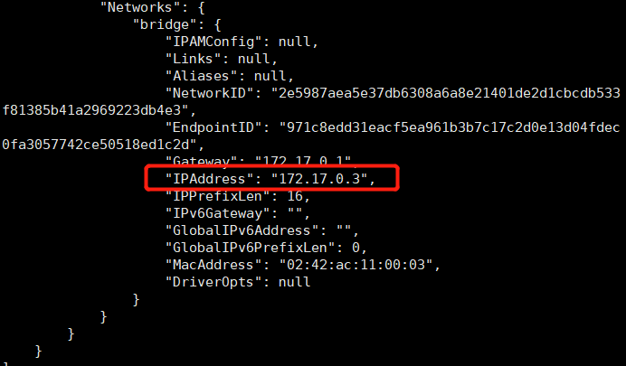

# Blog项目部署

## 购买云服务器

1. 选择云服务器

   我在618，购买了华为云服务器，（35元/1年），相关属性规格如下：

   

2. 简单配置服务器密码

   [参考链接](https://zhuanlan.zhihu.com/p/355243934)

3. 利用xshell链接数据库

   > 用户名为root


## 申请域名并备案

1. 选择一个域名

   仍然是在618，1块钱买了一年的域名hhhhh

   xxurongze.cn正在申请中

2. 域名解析

   [参考](https://support.huaweicloud.com/qs-dns/dns_qs_0002.html)

   验证：

   ```shell
   nslookup -qt=a huaweicloudsite.com
   ```

   

   > 由于我使用的是HECS，所以备案的服务器类型要选择授权码的方式

## 部署(思路)

1. 修改配置

   blog/blog-api/blog-api/src/main/resources/application.properties

   需要将此目录下的mysql, redis等进行配置

   blog/blog-api/blog-api/src/main/java/com/mszlu/blog/config/WebMVCConfig.java

   ```java
    @Override
       public void addCorsMappings(CorsRegistry registry) {
   //        //跨域配置
   //        registry.addMapping("/**").allowedOrigins("https://blog.mszlu.com","http://blog1.mszlu.com","http://localhost:8080");
           registry.addMapping("/**").allowedOrigins("http://www.xxurongze.cn");
       }
   ```

   

2. 修改编码

   在setting -> File Encoding 中 改为UTF-8

   

3. 打包


添加插件

blog/blog-api/pom.xml

```xml
    <build>
        <plugins>
            <plugin>
                <groupId>org.springframework.boot</groupId>
                <artifactId>spring-boot-maven-plugin</artifactId>
            </plugin>
        </plugins>
    </build>
```


## 安装服务器环境

[参考大佬链接](https://blog.csdn.net/dolpin_ink/article/details/123056852)

[参考码神链接](https://www.mszlu.com/java/blog/11/11.html#%E9%83%A8%E7%BD%B2%E7%9B%B8%E5%85%B3)


### Docker安装

#### docker安装

```shell
# 1、yum 包更新到最新 
yum update
# 2、安装需要的软件包， yum-util 提供yum-config-manager功能，另外两个是devicemapper驱动依赖的 
yum install -y yum-utils device-mapper-persistent-data lvm2
# 3、 设置yum源
yum-config-manager --add-repo https://download.docker.com/linux/centos/docker-ce.repo
# 4、 安装docker，出现输入的界面都按 y 
yum install -y docker-ce
# 5、 查看docker版本，验证是否验证成功
docker -v
#启动docker
/bin/systemctl start docker.service
```

#### 拉取docker镜像

```shell
docker pull nginx
docker pull redis:5.0.3
docker pull java:8
docker pull mysql:5.7
```


### Docker配置MySQL

创建容器，设置端口映射、目录映射

```shell
mkdir -p /mnt/docker/mysql
cd /mnt/docker/mysql
```

```shell
docker run -id -p 3307:3306 --name=c_mysql --network-alias c_mysql -v /mnt/docker/mysql/conf:/etc/mysql/conf.d -v /mnt/docker/mysql/logs:/logs -v /mnt/docker/mysql/data:/var/lib/mysql -e MYSQL_ROOT_PASSWORD=root mysql:5.7
```

> 对外是3307端口，对内是3306


在/mnt/docker/mysql/conf 创建my.cnf

```cnf

[mysqld]
##
## Remove leading ## and set to the amount of RAM for the most important data
## cache in MySQL. Start at 70% of total RAM for dedicated server, else 10%.
## innodb_buffer_pool_size = 128M
##
## Remove leading ## to turn on a very important data integrity option: logging
## changes to the binary log between backups.
## log_bin
##
## Remove leading ## to set options mainly useful for reporting servers.
## The server defaults are faster for transactions and fast SELECTs.
## Adjust sizes as needed, experiment to find the optimal values.
## join_buffer_size = 128M
## sort_buffer_size = 2M
## read_rnd_buffer_size = 2M
datadir=/var/lib/mysql
socket=/var/lib/mysql/mysql.sock
character-set-server=utf8
## Disabling symbolic-links is recommended to prevent assorted security risks
symbolic-links=0
lower_case_table_names=1
pid-file=/var/run/mysqld/mysqld.pid
sql_mode=STRICT_TRANS_TABLES,NO_ZERO_IN_DATE,NO_ZERO_DATE,ERROR_FOR_DIVISION_BY_ZERO,NO_AUTO_CREATE_USER,NO_ENGINE_SUBSTITUTION
```


后续如果改mysql的配置文件 可以改这里

```shell
##去查看mysql对应的docker容器ip地址，配置到项目
docker inspect c_mysql
```


多环境配置，创建生产环境的配置，和本地的分开

blog/blog-api/blog-api/src/main/resources/application-prod.properties

```properties
spring.datasource.url=jdbc:mysql://172.17.0.2:3307/blog?useUnicode=true&characterEncoding=UTF-8&serverTimeZone=UTC
spring.datasource.username=root
spring.datasource.password=root
spring.datasource.driver-class-name=com.mysql.cj.jdbc.Driver
```


创建数据库

```shell
#查看容器是否已经运行
docker ps  
#进入容器
docker exec -it c_mysql bash
#进入容器中的MYSQL
mysql -uroot -p
```

上传sql文件至/mnt/docker/mysql/data

```shell
mysql -uroot -p 
create database blog;
exit
#将文件导入数据库
mysql -uroot -p blog < blog.sql;
mysql -uroot -p 
use blog;
#执行sql并保存数据库
source blog.sql;
```


### Docker配置Redis

```shell
docker run -id --name=redis -p 6379:6379 redis:5.0.3
```

查看ip地址

```shell
docker inspect redis
```



blog/blog-api/blog-api/src/main/resources/application-prod.properties

```properties
spring.redis.host=172.17.0.3
spring.redis.port=6379
```


## 将项目打包成Dockerfile

- Dockerfile 是一个文本文件
- 包含了一条条的指令
- 每一条指令构建一层，基于基础镜像，最终构建出一个新的镜像
- 对于开发人员：可以为开发团队提供一个完全一致的开发环境
- 对于测试人员：可以直接拿开发时所构建的镜像或者通过Dockerfile文件 构建一个新的镜像开始工作了
- 对于运维人员：在部署时，可以实现应用的无缝移植


### 关键字

| 关键字      | 作用                     | 备注                                                         |
| ----------- | ------------------------ | ------------------------------------------------------------ |
| FROM        | 指定父镜像               | 指定dockerfile基于哪个image构建                              |
| MAINTAINER  | 作者信息                 | 用来标明这个dockerfile谁写的                                 |
| LABEL       | 标签                     | 用来标明dockerfile的标签 可以使用Label代替Maintainer 最终都是在docker image基本信息中可以查看 |
| RUN         | 执行命令                 | 执行一段命令 默认是/bin/sh 格式: RUN command 或者 RUN ["command" , "param1","param2"] |
| CMD         | 容器启动命令             | 提供启动容器时候的默认命令 和ENTRYPOINT配合使用.格式 CMD command param1 param2 或者 CMD ["command" , "param1","param2"] |
| ENTRYPOINT  | 入口                     | 一般在制作一些执行就关闭的容器中会使用                       |
| COPY        | 复制文件                 | build的时候复制文件到image中                                 |
| ADD         | 添加文件                 | build的时候添加文件到image中 不仅仅局限于当前build上下文 可以来源于远程服务 |
| ENV         | 环境变量                 | 指定build时候的环境变量 可以在启动的容器的时候 通过-e覆盖 格式ENV name=value |
| ARG         | 构建参数                 | 构建参数 只在构建的时候使用的参数 如果有ENV 那么ENV的相同名字的值始终覆盖arg的参数 |
| VOLUME      | 定义外部可以挂载的数据卷 | 指定build的image那些目录可以启动的时候挂载到文件系统中 启动容器的时候使用 -v 绑定 格式 VOLUME ["目录"] |
| EXPOSE      | 暴露端口                 | 定义容器运行的时候监听的端口 启动容器的使用-p来绑定暴露端口 格式: EXPOSE 8080 或者 EXPOSE 8080/udp |
| WORKDIR     | 工作目录                 | 指定容器内部的工作目录 如果没有创建则自动创建 如果指定/ 使用的是绝对地址 如果不是/开头那么是在上一条workdir的路径的相对路径 |
| USER        | 指定执行用户             | 指定build或者启动的时候 用户 在RUN CMD ENTRYPONT执行的时候的用户 |
| HEALTHCHECK | 健康检查                 | 指定监测当前容器的健康监测的命令 基本上没用 因为很多时候 应用本身有健康监测机制 |
| ONBUILD     | 触发器                   | 当存在ONBUILD关键字的镜像作为基础镜像的时候 当执行FROM完成之后 会执行 ONBUILD的命令 但是不影响当前镜像 用处也不怎么大 |
| STOPSIGNAL  | 发送信号量到宿主机       | 该STOPSIGNAL指令设置将发送到容器的系统调用信号以退出。       |
| SHELL       | 指定执行脚本的shell      | 指定RUN CMD ENTRYPOINT 执行命令的时候 使用的shell            |


### Dockerfile构建后端镜像

定义dockerfile，发布springboot项目

**实现步骤**

 ① 定义父镜像：FROM java:8

 ② 定义作者信息：MAINTAINER mszlu [test@mszlu.com](mailto:test@mszlu.com)

 ③ 将jar包添加到容器： ADD springboot.jar app.jar

 ④ 定义容器启动执行的命令：CMD java –jar app.jar

 ⑤ 通过dockerfile构建镜像：docker bulid –f dockerfile文件路径 –t 镜像名称:版本


#### 写文件

在/mnt/docker下创建文件夹

```shell
mkdir app
cd app
vim blog_dockerfile
```

写blog_dockerfile

```dockerfile
FROM java:8
MAINTAINER xxrz <xxurongze@gmail.com>
ADD ./blog_api.jar /app.jar
CMD java -jar /app.jar --spring.profiles.active=prod
```


#### 打包

多环境配置，重新打包


将blog/blog-api/blog-api/target/blog-api-1.0-SNAPSHOT.jar文件上传到服务器/mnt/docker/app下

修改名字

```shell
mv blog-api-1.0-SNAPSHOT.jar blog_api.jar
```


#### 构建

执行构建命令

```shell
docker build -f ./blog_dockerfile -t app .
```


### 构建前端镜像

修改前端的配置，打包，上传，并微调文件位置。

blog/blog-ui/config/prod.env.js

修改ip

```js
'use strict'
module.exports = {
  NODE_ENV: '"production"',
  BASE_API: '"http://114.115.145.198/api/"'
}
```

build项目，他会自动将项目生成到dist，手动压缩这个文件

```shell
npm run build
```

回到命令窗口界面，我们应该安装解压缩功能

```shell
#获取安装列表  yum安装列表中搜索zip/unzip是否存在

yum list | grep zip/unzip

#执行安装支持zip命令 根据提示输入y允许安装

yum install zip

#执行安装支持unzip命令 根据提示输入y允许安装

yum install unzip
```

创建对应的文件夹

```shell
mkdir /mnt/xxrz
mkdir /mnt/xxrz/blog
```

切换到blog目录下cd /mnt/xxrz/blog，把我们的前端dist压缩包上传上去

解压unzip dist.zip

然后移动文件位置

```shell
mv index.html ../
mv -r static ../
```

在/mnt/xxrz/blog下ls,应该是以下三个文件：dist.zip,index.html,static，其实有用的应该就是index.html以及static 


## 服务编排(springboot和nginx)

服务编排主要是利用Docker Compose将springboot和nginx分批启动

> Springboot就是我们自己打包的项目
>
> 而nginx的作用：
>
> ①将服务器上的静态文件（如HTML、图片）通过HTTP协议展现给客户端。
>
> ②反向代理服务器，这里nginx代理的就是前端资源客户端本来可以直接通过HTTP协议访问某网站应用服务器，网站管理员可以在中间加上一个Nginx，客户端请求Nginx，Nginx请求应用服务器，然后将结果返回给客户端。加一层代理可以实现负载均衡、虚拟主机等效果。（[具体请看](https://zhuanlan.zhihu.com/p/54793789)）


### 安装Docker Compose

```shell
## Compose目前已经完全支持Linux、Mac OS和Windows，在我们安装Compose之前，需要先安装Docker。下面我 们以编译好的二进制包方式安装在Linux系统中。 
curl -L https://get.daocloud.io/docker/compose/releases/download/1.22.0/docker-compose-`uname -s`-`uname -m` -o /usr/local/bin/docker-compose
## 设置文件可执行权限 
chmod +x /usr/local/bin/docker-compose
## 查看版本信息 
docker-compose -version
```


### 使用docker compose编排

nginx+springboot项目

#### 配置docker-compose

创建docker-compose目录

```shell
mkdir /mnt/docker/docker-compose
cd /mnt/docker/docker-compose
```


编写 docker-compose.yml 文件

```yml
version: '3'
services:
  nginx:
   image: nginx
   container_name: nginx
   ports:
    - 80:80
    - 443:443
   links:
   	- app
   depends_on:
    - app
   volumes:
    - /mnt/docker/docker-compose/nginx/:/etc/nginx/
    - /mnt/xxrz/web:/xxrz/web
    - /mnt/xxrz/blog:/xxrz/blog
   network_mode: "bridge"
  app:
    image: app
    container_name: app
    expose:
      - "8888"
    network_mode: "bridge"
```

> 这个文件中有个`depends_on`就是起到了编排目录的功能


#### 配置nginx

创建./nginx目录

```shell
mkdir -p ./nginx
cd /mnt/docker/docker-compose/nginx
vim nginx.conf
```

在./nginx目录下 编写nginx.conf文件

```conf
user nginx;
worker_processes  1;
error_log  /var/log/nginx/error.log warn;
pid        /var/run/nginx.pid;
events {
    worker_connections  1024;
}
http {
    include       /etc/nginx/mime.types;
    default_type  application/octet-stream;
    log_format  main  '$remote_addr - $remote_user [$time_local] "$request" '
                      '$status $body_bytes_sent "$http_referer" '
                      '"$http_user_agent" "$http_x_forwarded_for"';
    access_log  /var/log/nginx/access.log  main;
    sendfile        on;
    #tcp_nopush     on;
    keepalive_timeout  65;
    #gzip  on;
    include /etc/nginx/conf.d/*.conf;
}
```


新建conf.d文件夹，然后新建`blog.conf`文件

```shell
mkdir conf.d
cd conf.d
vim blog.conf
```

修改配置，将以下文件放入到`blog.conf`中

```conf
gzip_min_length 1k;
gzip_buffers 4 16k;
gzip_comp_level 2;
gzip_vary off;
upstream appstream{
     
        server app:8888;
}
server{
    # 监听端口
    listen  80;
    # 主机名称/地址
    #server_name www.xxurongze.cn xxurongze.cn;
    server_name 114.115.145.198:8080;
    index   index.html;
    # 前端服务
     location / {
        root /xxrz/blog/;
        # 刷新页面后跳转到当前页面
        try_files $uri $uri/ /index.html;
        index index.html;
     }

     # 后端api
     location /api {
                proxy_pass http://appstream;
    }

    location ~* \.(jpg|jpeg|gif|png|swf|rar|zip|css|js|map|svg|woff|ttf|txt)$ {
        root /xxrz/blog/;
        index index.html;
        add_header Access-Control-Allow-Origin *;
    }
}

```

如果是ip地址，不是域名的话

```shell
    server_name 114.115.145.198:8080;
```


创建mime.types文件

```shell
cd /mnt/docker/docker-compose/nginx
vim mime.types
```

```types

types {
    text/html                                        html htm shtml;
    text/css                                         css;
    text/xml                                         xml;
    image/gif                                        gif;
    image/jpeg                                       jpeg jpg;
    application/javascript                           js;
    application/atom+xml                             atom;
    application/rss+xml                              rss;

    text/mathml                                      mml;
    text/plain                                       txt;
    text/vnd.sun.j2me.app-descriptor                 jad;
    text/vnd.wap.wml                                 wml;
    text/x-component                                 htc;

    image/png                                        png;
    image/svg+xml                                    svg svgz;
    image/tiff                                       tif tiff;
    image/vnd.wap.wbmp                               wbmp;
    image/webp                                       webp;
    image/x-icon                                     ico;
    image/x-jng                                      jng;
    image/x-ms-bmp                                   bmp;

    font/woff                                        woff;
    font/woff2                                       woff2;

    application/java-archive                         jar war ear;
    application/json                                 json;
    application/mac-binhex40                         hqx;
    application/msword                               doc;
    application/pdf                                  pdf;
    application/postscript                           ps eps ai;
    application/rtf                                  rtf;
    application/vnd.apple.mpegurl                    m3u8;
    application/vnd.google-earth.kml+xml             kml;
    application/vnd.google-earth.kmz                 kmz;
    application/vnd.ms-excel                         xls;
    application/vnd.ms-fontobject                    eot;
    application/vnd.ms-powerpoint                    ppt;
    application/vnd.oasis.opendocument.graphics      odg;
    application/vnd.oasis.opendocument.presentation  odp;
    application/vnd.oasis.opendocument.spreadsheet   ods;
    application/vnd.oasis.opendocument.text          odt;
    application/vnd.openxmlformats-officedocument.presentationml.presentation
                                                     pptx;
    application/vnd.openxmlformats-officedocument.spreadsheetml.sheet
                                                     xlsx;
    application/vnd.openxmlformats-officedocument.wordprocessingml.document
                                                     docx;
    application/vnd.wap.wmlc                         wmlc;
    application/x-7z-compressed                      7z;
    application/x-cocoa                              cco;
    application/x-java-archive-diff                  jardiff;
    application/x-java-jnlp-file                     jnlp;
    application/x-makeself                           run;
    application/x-perl                               pl pm;
    application/x-pilot                              prc pdb;
    application/x-rar-compressed                     rar;
    application/x-redhat-package-manager             rpm;
    application/x-sea                                sea;
    application/x-shockwave-flash                    swf;
    application/x-stuffit                            sit;
    application/x-tcl                                tcl tk;
    application/x-x509-ca-cert                       der pem crt;
    application/x-xpinstall                          xpi;
    application/xhtml+xml                            xhtml;
    application/xspf+xml                             xspf;
    application/zip                                  zip;

    application/octet-stream                         bin exe dll;
    application/octet-stream                         deb;
    application/octet-stream                         dmg;
    application/octet-stream                         iso img;
    application/octet-stream                         msi msp msm;

    audio/midi                                       mid midi kar;
    audio/mpeg                                       mp3;
    audio/ogg                                        ogg;
    audio/x-m4a                                      m4a;
    audio/x-realaudio                                ra;

    video/3gpp                                       3gpp 3gp;
    video/mp2t                                       ts;
    video/mp4                                        mp4;
    video/mpeg                                       mpeg mpg;
    video/quicktime                                  mov;
    video/webm                                       webm;
    video/x-flv                                      flv;
    video/x-m4v                                      m4v;
    video/x-mng                                      mng;
    video/x-ms-asf                                   asx asf;
    video/x-ms-wmv                                   wmv;
    video/x-msvideo                                  avi;
}

```


## 运行

```shell
cd /mnt/docker/docker-compose
docker-compose up
```

其他命令

```shell
docker-compose up -d #-d 表示后台构建
docker-compose down  #停止并删除容器

docker-compose start #启动已有容器
docker-compose stop  #停止运行的容器
```

然后访问
博客网址：

http://www.xxurongze.cn

http://114.115.145.198


404是你的资源找不到了，看看前端的api配置 ,跨域配置有没有配置好


## 服务更新

如果更新vue前端直接更新，然后启动docker compose即可

如果更新后端，需要如下步骤：

1. 更新jar包

2. 构建镜像

   ```shell
   docker rm 
   docker rmi app
   cd /mnt/docker/app
   mv blog-api-1.0-SNAPSHOT.jar blog_api.jar
   docker build -f ./blog_dockerfile -t app .
   ```

   

3. 启动docker compose

