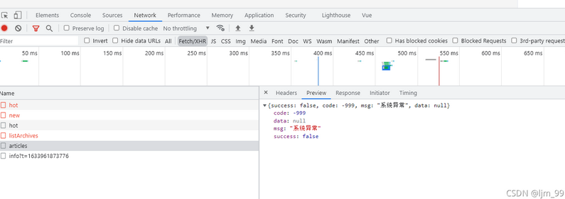
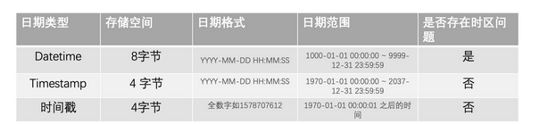
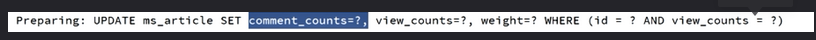

# 简历

**项目名称**：基于前后端分离的博客网站开发

**技术选型**：Spring + Mybatis-plus + MySQL + Redis

**项目描述**：本项目建立了一个博客网站，完成了从需求分析、数据库设计、到后端功能代码实现的整体开发流程。功能主要包含登录注册模块、最热文章查询、更新文章被阅读次数、系统日志追踪、文章管理等功能。从中学习到了Spring、Mybatis-plus、MySQL等技术栈。

**亮点：**

-   利用JWT + redis实现了登录功能，并利用AOP + ThreadLocal保存登录用户信息
-   利用AOP实现了系统日志，统一缓存处理，统一异常处理的功能
-   利用线程池 + CAS实现更新文章被阅读次数功能


# 总结

## 功能

### 最热文章查询

**Service层的实现类中利用mybatis-plus实现查询**

- 条件构造器Wrapper（sql语句的筛选条件）

 条件构造器其实就是一个对象，以方法的形式提供了数据库操作的筛选关键字

 我们调用该对象，来拼接我们的筛选条件即可。

- selectPage就是分页查询

- Active Record：对应表中的一行记录，所以返回结果是records

- 不能直接返回从数据库取出的数据，需要利用Vo处理下

    >   Spring提供的BeanUtils.copyProperties()：用于快速复制java bean，只对相同的属性进行复制


**mybatisplus 无法进行多表查询,需要使用mybatis的xml文件实现接口**

-   利用tag_name as tagName使数据库中的列名和类中的属性名一致
-   xml中的#{}中的参数是接口中的参数


**一般是从controller开始写，写到service，再写到dao(mapper)**

先写出sql语句

```sql
SELECT tag_id
		FROM ms_article_tag
		GROUP BY tag_id
		ORDER BY COUNT(*) DESC 
		LIMIT 3
```

>   CollectionUtils.isEmpty的作用：用来对集合null和空的判断，因为sql中的in关键字不能为空
>
>   如果为空，赋值为空值，返回Collections.emptyList()


collection是针对参数，如果参数是list，则使用此标签，利用foreach遍历

```xml
    <!-- List<Tag> findTagsByTagIds(List<Long> tagIds);-->
    <select id="findTagsByTagIds" parameterType="list" resultType="com.mszlu.blog.dao.pojo.Tag">
        select id,tag_name as tagName from ms_tag
        where id in
        <foreach collection="tagIds" item="tagId" separator="," open="(" close=")">
            #{tagId}
        </foreach>
    </select>
```


### controller层统一异常处理功能

不管是controller层还是service，dao层，都有可能报异常，如果是预料中的异常，可以直接捕获处理，如果是意料之外的异常，需要统一进行处理，进行记录，并给用户提示相对比较友好的信息。

**关键注解：**

**@ControllerAdvice**【修饰在类上】

**@ExceptionHandler(Exception.class)**【修饰在方法上】

> 概念：
>
> 是spring提供的新注解,本质上还是@Component ，是@Controller增强器, 可以对controller中使用到@RequestMapping注解的一下方法做逻辑处理。
>
> 做异常处理：
>
> 通常和 @ExceptionHandler注解结合使用,当异常抛到controller层时,可以对异常进行统一的处理,规定返回的json格式或者跳转到指定的错误页面等.

```java
//对加了@Controller注解的方法进行拦截处理 AOP的实现
@ControllerAdvice
public class AllExceptionHandler {
    //进行异常处理，处理Exception.class的异常
    @ExceptionHandler(Exception.class)
    @ResponseBody //返回json数据,不加的话是页面
    public Result doException(Exception ex){
        ex.printStackTrace();
        return Result.fail(-999,"系统异常");
    }

}
```



### 登录模块

#### JWT

##### 概念

首先明确jwt是一种token。Json web token (JWT), 该token被设计为紧凑且安全的，特别适用于分布式站点的单点登录（SSO）场景。JWT的声明一般被用来在身份提供者和服务提供者间传递被认证的用户身份信息，以便于从资源服务器获取资源。


##### 和传统session的区别

**传统session**

http协议本身是一种无状态的协议，用户的每一次请求都必须提供信息进行用户认证。为了减少这种信息的冗余，我们在服务器存储一份用户登录的信息，这份登录信息会在响应时传递给浏览器，告诉其保存为cookie,以便下次请求时发送给我们的应用，这样我们的应用就能识别请求来自哪个用户了,这就是传统的基于session认证。


**缺点**

-   **Session**: 每个用户经过我们的应用认证之后，我们的应用都要在服务端做一次记录，以方便用户下次请求的鉴别，通常而言session都是保存在内存中，而随着认证用户的增多，服务端的开销会明显增大。

-   **扩展性**: 用户认证之后，服务端做认证记录，如果认证的记录被保存在内存中的话，这意味着用户下次请求还必须要请求在这台服务器上,这样才能拿到授权的资源，这样在分布式的应用上，相应的限制了负载均衡器的能力。这也意味着限制了应用的扩展能力。


**使用token的原因**

基于token的鉴权机制类似于http协议也是无状态的，它不需要在服务端去保留用户的认证信息或者会话信息。这就意味着基于token认证机制的应用不需要去考虑用户在哪一台服务器登录了，这就为应用的扩展提供了便利。


##### JWT的组成

header：{“type”:“JWT”,“alg”:“HS256”} 固定【可被解密】

payload：存放信息，比如，用户id，过期时间等等，可以被解密，不能存放敏感信息【可被解密】

signature：签证，**A和B加上秘钥** 加密而成，只要秘钥不丢失，可以认为是安全的。【不可被解密，安全的】

jwt 验证，主要就是验证signature是否合法。


##### 去中心化的token验证流程

-   客户端提交账号和密码到服务端。

-   通过登录验证后，服务端响应由 JWT 生成的 Token 令牌。

-   客户端要访问服务器中其他资源，会在请求中带着 Token 到服务端。

-   服务端接收到请求之后，从 Token 中拿出 header 和 payload ，然后通过HS256算法将 header 和 payload 和 “盐” 值 进行计算得出内容，让计算出的内容与Token中的第三部分，也就是Signature去比较，如果一致则验证通过，反之则失败。

    >   注意此过程中，服务器是可以不进行token或者其他的信息的存储，使用token本身的三部分进行验证！


##### 中心化的token验证流程

-   客户端提交账号和密码到服务端。
-   通过登录验证后，服务端响应由 JWT 生成的 Token 令牌
-   服务器保存token在redis中
-   客户端要访问服务器中其他资源，会在请求中带着 Token 到服务端。
-   服务端接收到请求之后，先验证token是否合法。从 Token 中拿出 header 和 payload ，然后通过HS256算法将 header 和 payload 和 “盐” 值 进行计算得出内容，让计算出的内容与Token中的第三部分，也就是Signature去比较，如果一致则验证通过，反之则失败。
-   验证通过后再去redis中进行认证


**登录**

>   -   客户端提交账号和密码到服务端。
>   -   通过登录验证后，服务端响应由 JWT 生成的 Token 令牌
>   -   服务器保存token和user id的映射在redis中

**获取资源（获取用户信息）：**

>   -   客户端要访问服务器中其他资源，会在请求中带着 Token 到服务端。
>   -   服务端接收到请求之后，对token进行合法性验证
>       -   是否为空
>       -   解析是否一致
>       -   redis是否存在
>
>   -   验证失败则返回，否则返回相应的LoginUserVo

**使用中心化的token的验证的原因**

-   防止出现伪造token的情况，增加了安全性
-   登录用户做了token和user id的映射缓存，减少了查表的操作
-   可以扩展功能，使服务器对token做一些操作，比如灵活控制用户的过期（续期，踢掉线）


#### 代码

##### 登录

接口url：/login

请求方式：POST

请求参数：

| 参数名称 | 参数类型 | 说明 |
| -------- | -------- | ---- |
| account  | string   | 账号 |
| password | string   | 密码 |

返回数据：【后端给前端返还数据】

```json
{
    "success": true,
    "code": 200,
    "msg": "success",
    "data": "token"
}
```


**注意:**

使用了事务

检查string类型是否为空

```java
(StringUtils.isBlank(account) 
```

使用DigestUtils.md5Hex(password + salt);进行加密


**登录的实现逻辑**

```
检查参数是否合法
合法然后对密码进行加密，因为数据库中的密码是加密的
检查用户名密码是否正确，也就是去数据库中查找是否用户名和密码
如果不存在，则返回失败
如果存在则生成token，返回给前端
将token和用户的映射关系存入redis
```


queryWrapper的相关方法：

```java
queryWrapper.eq(SysUser::getAccount,account); //等值判断
queryWrapper.select(SysUser::getAccount,SysUser::getId,SysUser::getAvatar,SysUser::getNickname); //查询，同时对应方法的返回结果
queryWrapper.last("limit 1"); //追加
```

都是dao层去调用selectOne，selectList，selectPage方法，毕竟dao层通过maybatis-plus去访问数据库

sysUserMapper.selectOne(queryWrapper);


整体代码


##### 用户请求资源时验证token

登录以后要显示在页面上，所以使用了Result作为返回值


得从http的header里面拿到这个参数，这样传参相对来说安全一些，
返回的数据是我们用户相关的数据，id，账号、昵称和头像

接口url：/users/currentUser

请求方式：GET

请求参数：

| 参数名称      | 参数类型 | 说明            |
| ------------- | -------- | --------------- |
| Authorization | string   | 头部信息(TOKEN) |

返回数据：

```json
{
    "success": true,
    "code": 200,
    "msg": "success",
    "data": {
        "id":1,
        "account":"1",
        "nickaname":"1",
        "avatar":"ss"
    }
}
```

功能：

验证token合法性，根据token查用户，最后返回用户


**用户请求资源，验证token的逻辑**

-   服务端接收到请求之后，对token进行合法性验证
    -   是否为空
    -   解析是否一致
    -   redis是否存在


退出登录相当于是清除session

```java
@Override
    public Result logout(String token) {
        redisTemplate.delete("TOKEN_"+token);
        return Result.success(null);
    }

```


##### 注册

主要是注册的时候使用事务


接口url：/register

请求方式：POST

请求参数：

| 参数名称 | 参数类型 | 说明 |
| -------- | -------- | ---- |
| account  | string   | 账号 |
| password | string   | 密码 |
| nickname | string   | 昵称 |

返回数据：

```json
{
    "success": true,
    "code": 200,
    "msg": "success",
    "data": "token"
}
```


思路：

```
* 1. 判断参数 是否合法
* 2. 判断账户是否存在，存在 返回账户已经被注册
* 3. 不存在，注册用户并保存到数据库中

//感觉没有必要加token，在登录时就做了
* 4. 生成token
* 5. 存入redis 并返回
* 6. 注意 加上事务，一旦中间的任何过程出现问题，注册的用户 需要回滚
```

>   感觉sysuser中的account和avater有点重复了


##### 登录拦截器

**SpringMVC**

每次访问需要登录的资源的时候，都需要在代码中进行判断，一旦登录的逻辑有所改变，代码都得进行变动，非常不合适。

那么可不可以统一进行登录判断呢？

> springMVC中拦截器
>
> 可以，使用拦截器，进行登录拦截，如果遇到需要登录才能访问的接口，如果未登录，拦截器直接返回，并跳转登录页面。


**1.编写拦截器**

**拦截器思路**

实现HandlerInterceptor接口

重写preHandle方法

```java

/**
         * 1. 需要判断 请求的接口路径 是否为 HandlerMethod (controller方法)
         （因为还存在静态资源，不是方法，可能是一些网页啥的，需要将这些过滤掉）
         * 2. 判断 token是否为空，如果为空 未登录，进行拦截
         * 3. 如果token 不为空，验证token， loginService.checkToken
         * 4. 如果认证成功 放行
         */
```

>   注意：
>
>   -   因为如果失败了，需要给网页返回信息
>
>       就要设置格式
>
>       前后端分离，格式为json
>
>       ```java
>       response.setContentType("application/json;charset=utf-8");
>                   response.getWriter().print(JSON.toJSONString(result));
>       ```
>
>       

2.**设置需要拦截的窗口（页面）**

实现WebMvcConfigurer接口

重写addInterceptors方法

```java
@Configuration
public class WebMVCConfig implements WebMvcConfigurer {

    @Autowired
    private LoginInterceptor loginInterceptor;

    @Override
    public void addCorsMappings(CorsRegistry registry) {
        //跨域配置
        registry.addMapping("/**").allowedOrigins("http://localhost:8080");
    }

    @Override
    public void addInterceptors(InterceptorRegistry registry) {
    //假设拦截test接口后续实际遇到拦截的接口时，再配置真正的拦截接口
        registry.addInterceptor(loginInterceptor)
                .addPathPatterns("/test");
    }
}

```


3.**写一个需要被拦截的窗口**

```java
@RestController
@RequestMapping("test")
public class TestController {

    @RequestMapping
    public Result test(){
        return Result.success(null);
    }
}
```


**注意：**

##### 保存用户信息

由于每次请求资源都需要token验证，很麻烦，我们验证完，就可以将得到用户的信息进行保存，同时也不需要频繁的传递token

可以利用threadLocal保存用户信息，以便controller层直接获取


**思路：**

1.   写一个UserThreadLocal的类

     >   定义成员变量，需要定义为private static final类型
     >
     >   定义put,set,remove的static 方法

2.    在LoginInterceptor类中，将验证过的用户信息，put进来

3.   在需要使用用户信息的controller中进行get

     >   可以参考文章的publish方法


## 数据库表设计

主键：`bigint(0)`

>   **为什么不设置为long**
>
>   主键设置为id，刚开始设置为了long，造成了越界，所以要改为bigint
>
>   **为什么是bigint(0)，0代表什么**
>
>   整型数系统已经限制了取值范围，tinyint占1个字节、int占4个字节。所以整型数后面的m不是表示的数据长度，而是表示数据在显示时显示的最小长度

时间：`bigint(0)`

>   **数据库中可以用datetime、bigint、timestamp来表示时间，那么选择什么类型来存储时间比较合适呢？**
>
>   
>
>   ```sql
>   long time = System.currentTimeMillis();
>   
>   bigint：timeLong(time)
>   
>   datetime ：new Date(time) 【YYYY-MM-DD  HH:mm:ss 】
>   
>   timestamp：new Timestamp(time)【 1970.1.1到现在的毫秒数】
>   ```
>
>   查询性能：bigint > datetime > timestamp
>
>   时间排序性能：bigint > timestamp > datetime
>
>   总结：
>
>   如果需要对时间字段进行操作(如通过时间范围查找或者排序等)，推荐使用bigint；
>
>   如果时间字段不需要进行任何操作，推荐使用timestamp，因为：
>
>   - DateTime没有时区，Timestamp与时区相关，在不同时区，查询到同一条记录此字段的值会不一样，随机应变
>   - DateTime 类型耗费空间更大(8字节)，Timestamp(4字节)，

用户名：`varchar(255)`

密码：`varchar(64)`【MD5 + 加密盐】

>   **什么是加密盐？**
>
>   在密码学中，是指在散列之前将散列内容（例如：密码）的任意固定位置插入特定的字符串。
>
>   **为什么加加密盐？**
>
>   -   密码不能明文存储
>   -   在对用户密码进行加密时，需要考虑对密码进行掩饰，即使是相同的密码，也应该要保存为不同的密文，以防密码泄漏
>   -   即使用户输入的是弱密码，也需要考虑进行增强，从而增加密码被攻破的难度
>
>   **怎么实现？**
>
>   ```java
>   String pwd = DigestUtils.md5Hex(password + slat);
>   ```

评论数量：` int(0)`

文章内容： `longtext`

>   最大长度4294967295个字节 (2^32-1)

手机号：`varchar(64)`

>   **为什么不用bigint**
>
>   1.   首先，手机号的本质是字符串而不是数字，只是恰巧长得像数字而已。
>
>   2.   字符串可以通过LINK去匹配，查询很方便。 
>
>   3.   手机号可能有-（座机），用int存不了。

row_format（dynamic）：每条记录所占用的字节不一定一样（比如varchar），其优点节省空间，缺点增加读取的时间开销。

>   row_format（fixed）：每条记录所占用的字节一样（比如int），其优点读取快，缺点浪费额外一部分空间。  


## 遇到的问题

### 问题一

问题：在阅读更新次数的时候，导致是否置顶的值被错更为0

原因：articleUpdate.setviewsCounts(viewCounts+1)，但是weight字段是int类型，类初始化时，赋值其为0，mybatisplus规则是但凡不是null就会生成到sql语句中进行更新，所以更新了错误的值



解决：

将int改为Integer

```java
@Data
public class Article {

    public static final int Article_TOP = 1;

    public static final int Article_Common = 0;

    private Long id;

    private String title;

    private String summary;

    private Integer commentCounts;

    private Integer viewCounts;
    ...
}
```


### 问题二

问题：评论失败，显示获取不到文章

原因：分布式id 比较长，传到前端 会有精度损失，必须转为string类型 进行传输

解决：

-   使用序列化

```java
public class CommentVo  {
    //防止前端 精度损失 把id转为string
    @JsonSerialize(using = ToStringSerializer.class)
    private Long id;
```

-   直接声明为String


## 面试问题

[参考链接一](https://blog.csdn.net/weixin_48610702/article/details/115859656?utm_source=app&app_version=5.0.1&code=app_1562916241&uLinkId=usr1mkqgl919blen)

[参考链接二](https://blog.csdn.net/lijiaming_99/article/details/120922916)

### 项目的基础功能有哪些？

用户登录，注册，评论、发布、编辑文章

首页展示文章列表、最新标签、最热文章、文章归档；搜索文章、文章分类

系统日志追踪、文章管理等功能


### 什么是Spring框架


### 对Spring IoC的理解


### 什么是DAO


### Spring中关于Bean的注解


### Spring MVC是什么，是怎样的工作流程

服务器分为表现层/业务层/数据层，其中Spring MVC是工作在表现层，作用是接收/解析用户发送的请求，调用对应的业务类，根据业务类返回的结果（ModelAndView)，调用view进行视图渲染，并将渲染后的View返回给请求者。具体分为以下8步。

    客户端（浏览器）发送请求给前端处理器（DispatcherServlet)(发送请求，响应结果)；
    DispatcherServlet根据请求信息调用HandlerMapping，查找到对应的Handler；
    查找到对应的Handler(也就是Controller)后，由HandlerAdapter适配器处理；
    HandlerAdapter根据Handler来调用真正的Controller；
    Controller进行业务处理，返回ModelAndView对象，Model是数据对象，View是逻辑上的View；
    ViewResolver根据逻辑view找到实际view；
    DispatcherServlet把Model传给view进行视图渲染，然后返回给请求者。

C - Controller：控制器。接受用户请求，调用 Model 处理，然后选择合适的View给客户。
M - Model：模型。业务处理模型，接受Controller的调遣，处理业务，处理数据。
V - View：视图。返回给客户看的结果。

### DispatcherServlet处理流程？

 DispatcherServlet 处理流程：

在整个 Spring MVC 框架中，DispatcherServlet 处于核心位置，它负责协调和组织不同组件完成请求处理并返回响应工作。DispatcherServlet 是 SpringMVC统一的入口，所有的请求都通过它。DispatcherServlet 是前端控制器，配置在web.xml文件中，Servlet依自已定义的具体规则拦截匹配的请求，分发到目标Controller来处理。 初始化 DispatcherServlet时，该框架在web应用程序WEB-INF目录中寻找一个名为[servlet-名称]-servlet.xml的文件，并在那里定义相关的Beans，重写在全局中定义的任何Beans。在看DispatcherServlet 类之前，我们先来看一下请求处理的大致流程：

    Tomcat 启动，对 DispatcherServlet 进行实例化，然后调用它的 init() 方法进行初始化，在这个初始化过程中完成了：对 web.xml 中初始化参数的加载；建立 WebApplicationContext(SpringMVC的IOC容器)；进行组件的初始化；
    客户端发出请求，由 Tomcat 接收到这个请求，如果匹配 DispatcherServlet 在 web.xml中配置的映射路径，Tomcat 就将请求转交给 DispatcherServlet 处理；
    DispatcherServlet 从容器中取出所有 HandlerMapping 实例（每个实例对应一个 HandlerMapping接口的实现类）并遍历，每个 HandlerMapping 会根据请求信息，通过自己实现类中的方式去找到处理该请求的 Handler(执行程序，如Controller中的方法)，并且将这个 Handler 与一堆 HandlerInterceptor (拦截器)封装成一个 HandlerExecutionChain 对象，一旦有一个 HandlerMapping 可以找到 Handler则退出循环；
    DispatcherServlet 取出 HandlerAdapter 组件，根据已经找到的 Handler，再从所有HandlerAdapter 中找到可以处理该 Handler 的 HandlerAdapter 对象；
    执行 HandlerExecutionChain 中所有拦截器的 preHandler() 方法，然后再利用
    HandlerAdapter 执行 Handler ，执行完成得到 ModelAndView，再依次调用拦截器的
    postHandler() 方法；
    利用 ViewResolver 将 ModelAndView 或是 Exception（可解析成 ModelAndView）解析成View，然后 View 会调用 render() 方法再根据 ModelAndView 中的数据渲染出页面；
    最后再依次调用拦截器的 afterCompletion() 方法，这一次请求就结束了。

### 拦截器的作用

目的：让未登录用户不能访问某些页面
原理：在方法前标注自定义注解，拦截所有的请求，只处理带有该注解的方法。

### 什么是SSM框架？

包括Spring + Spring MVC(和Spring天生集成) + MyBatis（帮你和数据库打交道的框架，简单的设置，你就可以像Java一样，操作数据库了）


### 什么是Interceptor，在项目的哪里使用到了Interceptor?

Interceptor是SpringMVC的处理器（handler)拦截器，用于对处理器进行预处理和后处理。本项目中，每次请求都会检查request中的login_ticket，把找到的user信息存放在协程中，并在完成处理后，自动释放。（方便的进行用户信息取用）


### 是怎样实现统一捕获异常的？

在SpringBoot的项目某一路径下，加上对应的错误页面，发生错误时自动会跳转。服务器的三层结构中，错误会层层向上传递，所以只需要在表现层（controller)统一处理错误即可。
方法：在controller中加上advice包，并通过注解@ControllerAdvice和@ExceptionHandler，统一捕获异常。


### 是怎样实现统一记录日志的？

使用了AOP技术（面向切面编程），这里使用到的是SpringAOP。 AOP技术能够将哪些与业务，但是为业务模块共同调用的逻辑或责任（比如事务处理，日志记录，权限控制等），封装起来，便于减少系统的重复代码，降低模块间的耦合度，并有利于未来的扩展性和维护性。 SpringAOP本质上基于动态代理，当要代理的对象实现了某接口，会使用JDK动态代理，在运行时通过创建接口的代理实例，织入代码。当要代理的对象没有实现接口，则使用Cglib技术（编译时增强），通过子类代理织入代码。

### 什么是Redis，Redis有哪些优点？

概念：redis是一个非关系型数据库，数据存储在内存中，读写速度快。可以存储键和五种不同类型值的映射。只能以字符串为键，值支持：字符串，列表，无序集合，有序集合，hash散列表。
优点：由于数据存储在内存中，读写速度非常快，满足高性能，高并发的系统要求。与Java原生的map/guava相比，支持分布式缓存。与memcached相比，支持更丰富的数据类型，且支持数据持久化。

### 怎么往Spring框架中配置Redis，介绍常见的Redis操作

如何配置：
1，导入jar包
2，配置端口，以及配置类redisTemplate（注入连接工厂/设置序列化方式（json））
常见操作
Value类型：redisTemplate.opsForValue().set(redisKey, 1)，redisTemplate.opsForValue().get(redisKey)， redisTemplate.opsForValue().increment(redisKey)，
Hash类型：redisTemplate.opsForHash().put(redisKey, “id”, 1)， 还有get等操作
List类型：redisTemplate.opsForList().leftPush(redisKey, 101)， 还有size, index, range， leftPop等操作
Set类型：add, size, pop, members等操作
Zset类型：redisTemplate.opsForZSet().add(redisKey, “Linda”, 92), 有socre，rank，reverseRank， range等操作
操作key：可以delete，以及设置过期时间
同时支持绑定操作，支持事务（编程式事务，在事务中一般不包含查询）
为什么不包含查询：redis事务就是一系列命令的批量操作，批量操作在发送 EXEC 命令前被放入队列缓存，并不会被实际执行，也就不存在事务内的查询要看到事务里的更新，事务外查询不能看到。

### 项目中Redis的作用

1、事务操作：redisTemplate直接调用opfor…来操作redis数据库，每执行一条命令是要重新拿一个连接，因此很耗资源，让一个连接直接执行多条语句的方法就是使用SessionCallback，同样作用的还有RedisCallback，但不常用。
2、使用redis存储验证码：

    因为验证码需要频繁的进行访问与刷新，因此对性能的要求较高；
    验证码不需要永久保存，通常在很短的时间后就会失效；
    分布式部署的时候，存在session共享的问题。

3、使用redis存储登录凭证：
因为后台在每次处理请求的时候都要查询用户的登录凭证，访问的频率非常高，因此需要使用redis存储。
4、使用redis缓存用户信息：
因为后台在每次处理请求的时候都要根据用户的凭证用户信息，访问的频率非常高。
5、Redis可以使用zset对需要排序的数据进行自定义的排序。

### 访问过多

利用缓存、消息队列


### 项目中具体的功能点如何优化


### 项目中遇到的最大的问题如何解决的


### 登录


### 如果优化从哪些点来优化


### 某某技术栈的作用


### 文章是否有热榜排序功能？使用的是Redis那个数据结构？
